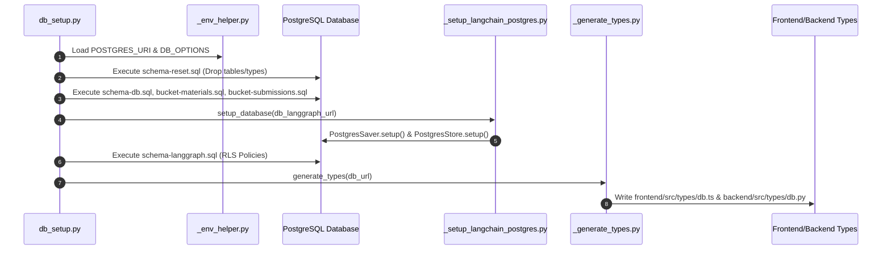

# Scripts Architecture & Execution Lifecycle

This document details the design patterns, execution pipelines, and environmental contracts of the automation scripts in `scripts/`.

---

## 1. Database Provisioning & Schema Synchronization Pipeline

The master script [`db_setup.py`](file:///home/victor/antigravity/Teacher-Assistant-Workspace/scripts/db_setup.py) coordinates a 5-stage idempotent migration and contract generation workflow:

---

## 2. Key Modules & Design Decisions

### Auto-Virtualenv Fallback:
In [`db_setup.py`](file:///home/victor/antigravity/Teacher-Assistant-Workspace/scripts/db_setup.py), if `psycopg` is not found in the calling Python environment, the script detects the backend virtualenv (`backend/.venv/bin/python`) and transparently re-executes itself using `os.execv`, preventing missing dependency errors during manual runs.

### Schema Separation & Checkpointer Scoping:
- Main application tables reside in the `public` PostgreSQL schema.
- LangGraph checkpoints are isolated in the `langgraph` schema via `DB_OPTIONS="-c search_path=langgraph"`, ensuring agent persistence artifacts do not clutter domain entity tables.

### Contract Generation Contract:
[`_generate_types.py`](file:///home/victor/antigravity/Teacher-Assistant-Workspace/scripts/_generate_types.py) uses the Supabase CLI (`npx -y supabase gen types`) to derive strict types directly from PostgreSQL catalog reflections, guaranteeing that frontend TypeScript types and backend Python models remain in lockstep with the database DDL.
