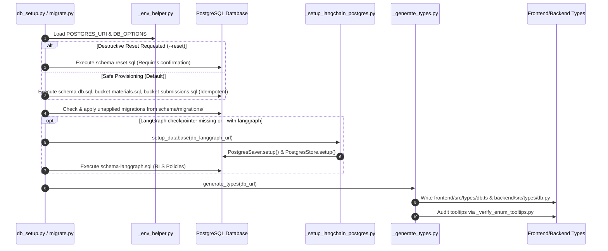

# Scripts Architecture & Execution Lifecycle

This document details the design patterns, execution pipelines, and environmental contracts of the automation scripts in `scripts/`.

---

## 1. Database Provisioning & Schema Synchronization Pipeline

The setup script [`db_setup.py`](file:///home/victor/antigravity/Teacher-Assistant-Workspace/scripts/db_setup.py) and migration tool [`migrate.py`](file:///home/victor/antigravity/Teacher-Assistant-Workspace/scripts/migrate.py) coordinate a safe, non-destructive migration and contract generation workflow:

---

## 2. Key Modules & Design Decisions

### Accidental Data Loss Prevention:
In [`db_setup.py`](file:///home/victor/antigravity/Teacher-Assistant-Workspace/scripts/db_setup.py), destructive database drops via `schema-reset.sql` are strictly guarded behind the `--reset` flag and require interactive typed confirmation (`RESET`) unless `-y` / `--yes` is explicitly provided. Regular execution is strictly non-destructive.

### Incremental Migration Tracking:
[`migrate.py`](file:///home/victor/antigravity/Teacher-Assistant-Workspace/scripts/migrate.py) maintains a `public._schema_migrations` catalog table in PostgreSQL, ensuring that scripts in `schema/migrations/` are applied in sorted order exactly once, while allowing `--status` inspections and `--fake` recordings.

### Redundant LangGraph Initialization Bypass:
LangGraph checkpoint and store table initialization (`PostgresSaver.setup()` and `PostgresStore.setup()`) takes noticeable execution time and issues DDL transactions. `db_setup.py` detects if `langgraph.checkpoints` already exists in PostgreSQL, bypassing setup unless `--with-langgraph` or `--reset` is requested.

### Auto-Virtualenv Fallback:
In [`db_setup.py`](file:///home/victor/antigravity/Teacher-Assistant-Workspace/scripts/db_setup.py), if `psycopg` is not found in the calling Python environment, the script detects the backend virtualenv (`backend/.venv/bin/python`) and transparently re-executes itself using `os.execv`, preventing missing dependency errors during manual runs.

### Schema Separation & Checkpointer Scoping:
- Main application tables reside in the `public` PostgreSQL schema.
- LangGraph checkpoints are isolated in the `langgraph` schema via `DB_OPTIONS="-c search_path=langgraph"`, ensuring agent persistence artifacts do not clutter domain entity tables.

### Contract Generation & Tooltip Auditing:
[`_generate_types.py`](file:///home/victor/antigravity/Teacher-Assistant-Workspace/scripts/_generate_types.py) uses the Supabase CLI (`npx -y supabase gen types`) to derive strict types directly from PostgreSQL catalog reflections, guaranteeing that frontend TypeScript types and backend Python models remain in lockstep with the database DDL. Following type generation, [`_verify_enum_tooltips.py`](file:///home/victor/antigravity/Teacher-Assistant-Workspace/scripts/_verify_enum_tooltips.py) automatically audits generated enum constants against pedagogical UI tooltip definitions in `frontend/src/utils/enumTooltips.ts`.
