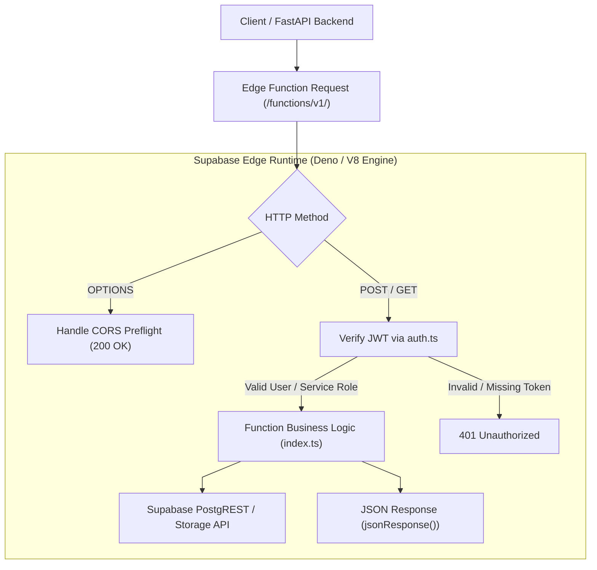

# Supabase Subsystem Architecture

This document details the Supabase edge runtime architecture, function isolation, and secret management across `supabase/`.

---

## 1. Supabase Edge Runtime Architecture

---

## 2. Security & Runtime Invariants

1. **Deno V8 Isolate Security**:
   Each Edge Function executes in an isolated V8 sandbox with zero persistence between independent invocations.
2. **Environment Separation**:
   Functions access runtime secrets via `Deno.env.get()` (`SUPABASE_URL`, `SUPABASE_SERVICE_ROLE_KEY`, `SUPABASE_ANON_KEY`), avoiding committed secrets.
