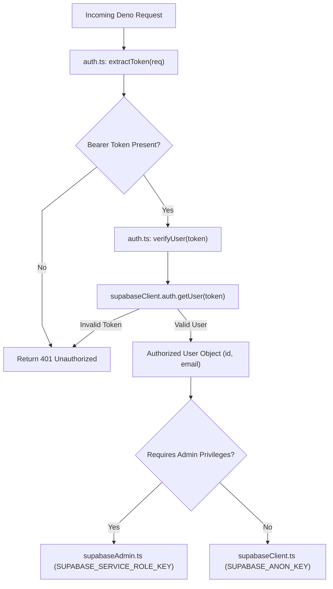

# Shared Utilities Architecture & Security Boundaries

This document details the shared authentication architecture, client creation patterns, and CORS mechanisms in `supabase/functions/_shared/`.

---

## 1. Authentication & Client Initialization Architecture

---

## 2. Key Design & Security Invariants

1. **Service Role Isolation (`supabaseAdmin.ts`)**:
   - `SUPABASE_SERVICE_ROLE_KEY` is loaded strictly inside serverless edge runtime memory and is never passed in client response bodies or exposed to frontend callers.
2. **CORS Protocol Uniformity (`cors.ts`)**:
   - `jsonResponse(data, status)` automatically injects `corsHeaders` along with standard `application/json` content-type headers, preventing missing-CORS edge errors on 4xx/5xx responses.
3. **Environment Defensive Guards (`env.ts`)**:
   - Validates the existence of critical keys on runtime startup and raises clear exceptions if required configuration variables are missing.
