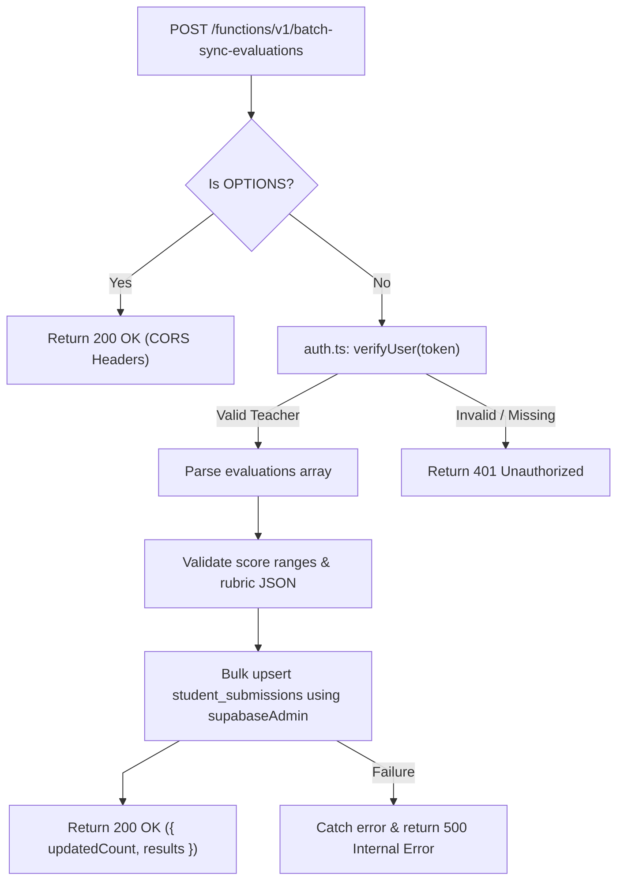

# Batch Sync Evaluations Architecture

This document details the batch processing architecture, validation contracts, and database updates for `supabase/functions/batch-sync-evaluations/`.

---

## 1. Batch Synchronization Pipeline



---

## 2. Interface Contracts & Data Invariants

### Request Payload Schema:
```typescript
interface BatchEvaluationPayload {
  class_id: string;
  evaluations: Array<{
    submission_id: string;
    score: number;
    rubric_breakdown: Record<string, number>;
    feedback?: string;
    private_teacher_notes?: string;
    status: 'Evaluated' | 'Graded';
  }>;
}
```

### Security & Invariants:
- Uses `supabaseAdmin` client to commit verified evaluations.
- Verifies that the requesting teacher is the authorized owner of the associated `class_id` before committing updates to prevent unauthorized cross-tenant modifications.
