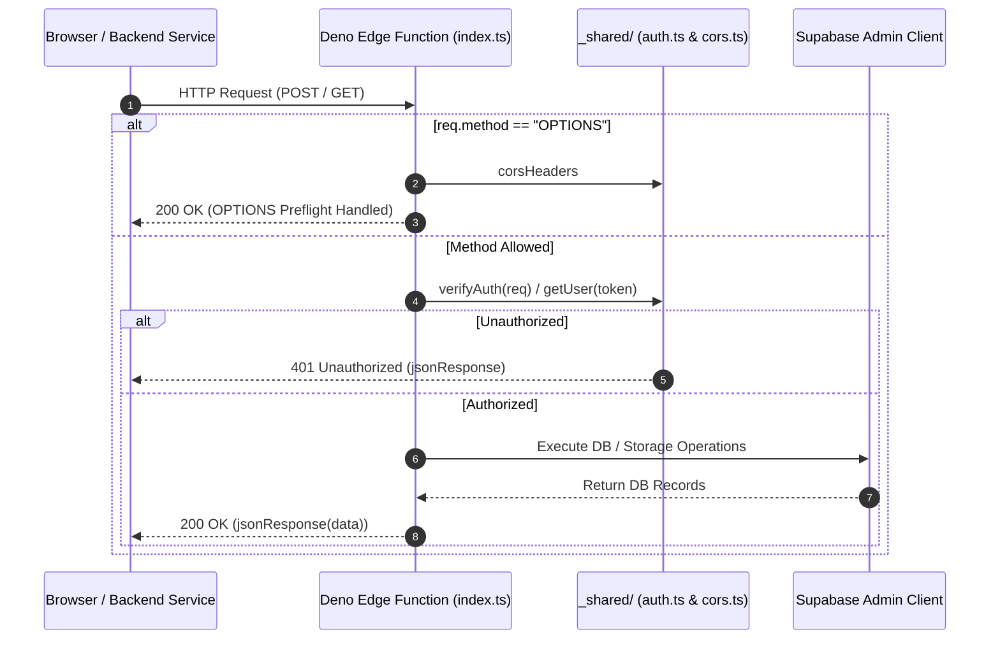

# Edge Functions Architecture & Invocation Lifecycle

This document details the shared execution lifecycle, CORS handling, and authentication protocols for functions in `supabase/functions/`.

---

## 1. Edge Function Request Lifecycle

---

## 2. Shared Protocol Invariants

1. **Standardized CORS Handling**:
   Every edge function immediately intercepts `OPTIONS` requests, returning standard CORS headers (`Access-Control-Allow-Origin: *`, `Access-Control-Allow-Headers: ...`).
2. **Unified Response Formatting**:
   Responses are returned using `jsonResponse(payload, statusCode)` from `_shared/cors.ts` with explicit `Content-Type: application/json` headers.
3. **Strict Error Guarding**:
   Handlers wrap domain logic in top-level `try/catch` blocks, returning structured JSON `{ error: string }` on failure rather than plain text error traces.
