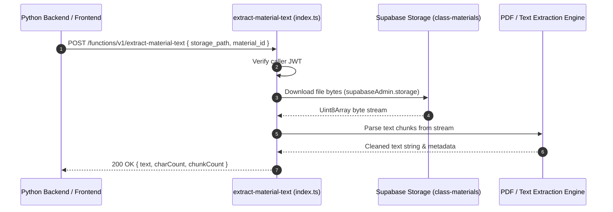

# Text Extraction Architecture & Pipeline

This document details the document text extraction pipeline and storage access contracts in `supabase/functions/extract-material-text/`.

---

## 1. Extraction Pipeline Architecture

---

## 2. Invariants & Performance Design

1. **Streaming Downloads**:
   Downloads binary blobs directly into memory buffers, parses content, and clears references immediately to adhere to Deno memory constraints.
2. **Path Sanitization**:
   Strictly validates `storage_path` against UUID path segments (`{teacher_id}/{material_id}/{content_item_id}`) to prevent path traversal attempts.
