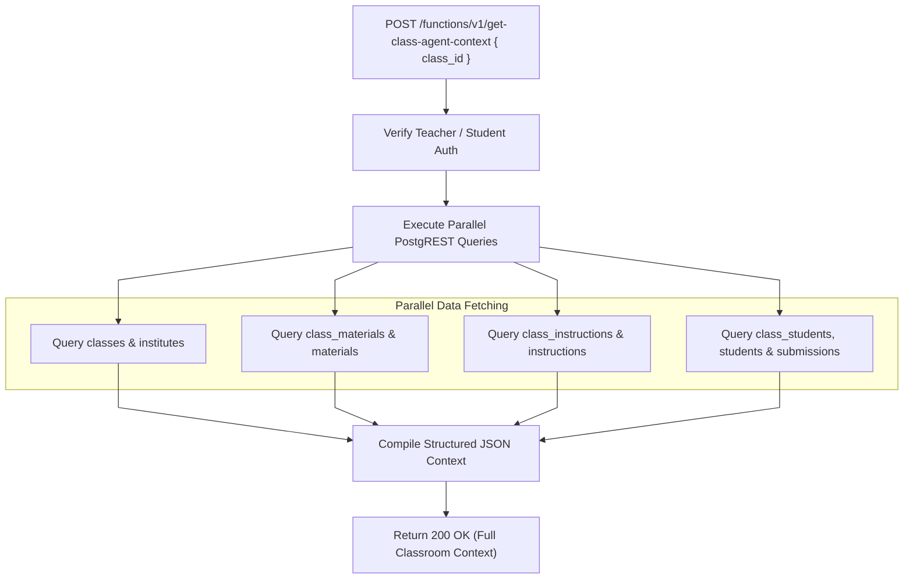

# Agent Context Aggregation Architecture

This document details the aggregation architecture, relational joining strategies, and caching models for `supabase/functions/get-class-agent-context/`.

---

## 1. Context Aggregation Pipeline



---

## 2. Invariants & Output Contract

### Context Response Schema:
```typescript
interface ClassAgentContextResponse {
  class: {
    id: string;
    name: string;
    subject: string;
    academicYear: string;
    semester: string;
    teachingStyle: string[];
    assessmentPreferences: string[];
    specialNotes?: string;
  };
  materials: Array<{ id: string; name: string; category: string; content: any[] }>;
  instructions: Array<{ id: string; title: string; type: string; content: string }>;
  students: Array<{
    id: string;
    name: string;
    rollNumber: string;
    attendanceRate: number;
    submissions: any[];
  }>;
}
```

### Performance Optimization:
- Uses `Promise.all` to query database junction tables concurrently, minimizing serverless runtime latency.
