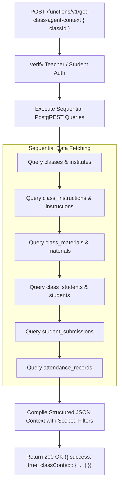

# Agent Context Aggregation Architecture

This document details the aggregation architecture, relational joining strategies, and caching models for `supabase/functions/get-class-agent-context/`.

---

## 1. Context Aggregation Pipeline


```mermaid
%%{init: {'flowchart': {'curve': 'linear'}}}%%
flowchart TD
    Req["POST /functions/v1/get-class-agent-context { classId }"] --> Auth["Verify Teacher / Student Auth"]
    
    Auth --> SequentialQueries["Execute Sequential PostgREST Queries"]
    
    subgraph DataAssembly["Sequential Data Fetching"]
        ClassMeta["Query classes & institutes"]
        Instructions["Query class_instructions & instructions"]
        Materials["Query class_materials & materials"]
        Students["Query class_students & students"]
        Submissions["Query student_submissions"]
        Attendance["Query attendance_records"]
    end

    SequentialQueries --> ClassMeta --> Instructions --> Materials --> Students --> Submissions --> Attendance
    Attendance --> Aggregator["Compile Structured JSON Context with Scoped Filters"]
    Aggregator --> Response["Return 200 OK ({ success: true, classContext: { ... } })"]
```

---

## 2. Invariants & Output Contract

### Context Response Schema:
```typescript
interface ClassAgentContextResponse {
  success: boolean;
  classContext: {
    id: string;
    name: string;
    subject: string;
    academicYear: string;
    semester: string;
    instituteName?: string;
    teachingStyle: string[];
    assessmentPreferences: string[];
    specialNotes?: string;
    instructions: Array<{ id: string; title: string; type: string; content: string }>;
    materials: Array<{ id: string; name: string; category: string; content: any[]; maxScore?: number; rubricCriteria?: any }>;
    students: Array<{
      id: string;
      name: string;
      rollNumber?: string;
      email?: string;
      currentScore?: number;
      currentGrade?: string;
      performanceTier?: string;
      attendance?: number;
      submissions?: any[];
    }>;
    totalEnrolled: number;
    totalMaterials: number;
    totalInstructions: number;
    totalSubmissions: number;
    scopedContext?: {
      scopeType: 'class' | 'students' | 'materials' | 'assessments';
      selectedCount: number;
    };
  };
}
```

### Scoped Context Invariant:
- Supports `scope_type` filtering (`'class' | 'students' | 'materials' | 'assessments'`) and `selected_ids` to tailor the assembled prompt context to user-selected items in the copilot drawer.
