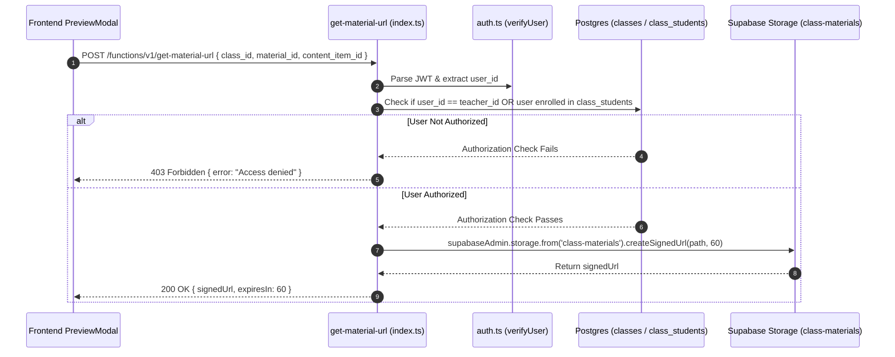

# Material Signed URL Architecture & Security Flow

This document details the authorization verification and signed URL generation architecture in `supabase/functions/get-material-url/`.

---

## 1. Authorization & URL Signing Pipeline

---

## 2. Key Security Invariants

1. **Short-Lived Expiration**:
   Signed URLs are configured with short TTLs (e.g. 60 seconds) to prevent URL sharing or link leakage outside the active user session.
2. **Double-Checked Access Control**:
   Even though Storage RLS guards direct bucket calls, this function adds an application-level membership check before generating administrative signed URLs.
