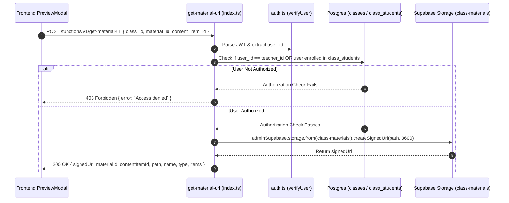

# Material Signed URL Architecture & Security Flow

This document details the authorization verification and signed URL generation architecture in `supabase/functions/get-material-url/`.

---

## 1. Authorization & URL Signing Pipeline

```mermaid
sequenceDiagram
    autonumber
    participant Client as Frontend PreviewModal
    participant EdgeFunc as get-material-url (index.ts)
    participant Auth as auth.ts (verifyUser)
    participant DB as Postgres (classes / class_students)
    participant Storage as Supabase Storage (class-materials)

    Client->>EdgeFunc: POST /functions/v1/get-material-url { class_id, material_id, content_item_id }
    EdgeFunc->>Auth: Parse JWT & extract user_id
    EdgeFunc->>DB: Check if user_id == teacher_id OR user enrolled in class_students
    alt User Not Authorized
        DB-->>EdgeFunc: Authorization Check Fails
        EdgeFunc-->>Client: 403 Forbidden { error: "Access denied" }
    else User Authorized
        DB-->>EdgeFunc: Authorization Check Passes
        EdgeFunc->>Storage: adminSupabase.storage.from('class-materials').createSignedUrl(path, 3600)
        Storage-->>EdgeFunc: Return signedUrl
        EdgeFunc-->>Client: 200 OK { signedUrl, materialId, contentItemId, path, name, type, items }
    end
```

---

## 2. Key Security Invariants

1. **Controlled Expiration (1 Hour)**:
   Signed URLs are configured with 3600-second (1-hour) TTLs to allow sufficient time for in-app previewing, printing, and reading while preventing indefinite public URL leakage.
2. **Double-Checked Access Control**:
   Even though Storage RLS guards direct bucket calls, this function adds an application-level membership check before generating administrative signed URLs.
