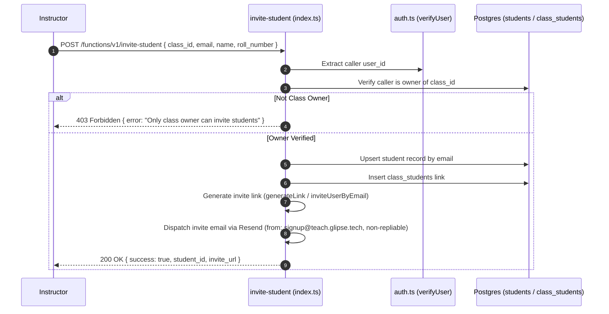

# Student Invitation Architecture & Roster Enrollment

This document details the student invitation workflow, permission checks, and enrollment mutations in `supabase/functions/invite-student/`.

---

## 1. Invitation & Enrollment Flow

---

## 2. Invariants & Multi-Tenant Boundaries

1. **Idempotent Student Upserts**:
   If a student with the provided email already exists globally under the teacher's profile, the existing record is reused and linked to the new class via `class_students`.
2. **Owner-Only Enforcement**:
   Enforces strict teacher-class ownership validation before any record creation or enrollment mutation occurs.
3. **Sender & Non-Repliable Routing**:
   Student invitations are dispatched from `signup@teach.glipse.tech` (override via `STUDENT_INVITE_FROM_EMAIL`). The email is explicitly configured as non-repliable:
   - `reply_to` payload attribute: `no-reply@teach.glipse.tech` (override via `STUDENT_INVITE_REPLY_TO`).
   - Standard non-response headers: `Reply-To: no-reply@teach.glipse.tech`, `Auto-Submitted: auto-generated`, `X-Auto-Response-Suppress: All`.
   - Branded footer explicitly notifying the recipient that replies cannot be monitored.
