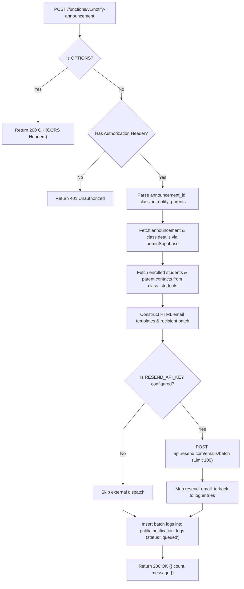

# Notify Announcement Architecture

This document details the batch dispatch sequence, recipient resolution, and audit logging for `supabase/functions/notify-announcement/`.

---

## 1. Notification Pipeline Flow



---

## 2. Interface Contracts & Invariants

### Invocation Payload:
```typescript
interface NotifyAnnouncementPayload {
  announcement_id: string;
  class_id: string;
  notify_parents?: boolean;
}
```

### Audit Log Entity (`public.notification_logs`):
- `class_id`: Scope of the announcement.
- `announcement_id`: Referenced announcement.
- `notification_type`: `'announcement'`.
- `recipient_email`: Target email.
- `recipient_type`: `'student' | 'parent'`.
- `resend_email_id`: Unique delivery tracking ID returned by Resend.
- `status`: Initially `'queued'`; transitioned by webhook.

### Invariants:
- **Resend Batch Limit**: Maximum 100 recipients per HTTP dispatch call.
- **Fail-Safe Graceful Degradation**: If `RESEND_API_KEY` is missing or Resend API returns an error, the function continues to record queued logs rather than failing with a fatal HTTP 500.
- **Teacher Reply-To Routing**: Automatically sets the email's `reply_to` payload attribute to the instructor's verified email address (retrieved from `auth.admin.getUserById(classItem.user_id)`), ensuring student or parent replies route directly to the teacher's inbox.
