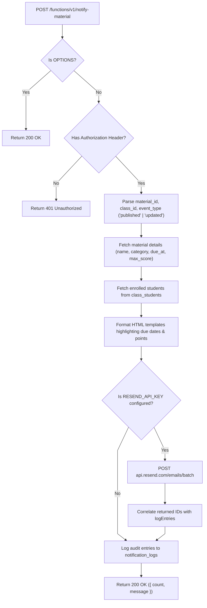

# Notify Material Architecture

This document details the recipient fan-out, event verb differentiation, and dispatch pipeline for `supabase/functions/notify-material/`.

---

## 1. Material Notification Sequence



---

## 2. Interface Contracts & Invariants

### Invocation Payload:
```typescript
interface NotifyMaterialPayload {
  material_id: string;
  class_id: string;
  event_type?: 'published' | 'updated';
  notify_parents?: boolean;
}
```

### Invariants:
- **Event Verb Customization**: Adjusts subject line and email headers between `"New"` vs `"Updated"` based on `event_type`.
- **Due Date Visibility**: When `due_at` is set, dates are formatted to ensure clear deadline visibility for students.
- **Audit Logging**: Every recipient generates a row in `public.notification_logs` with `notification_type` set to `'material_published'` or `'material_updated'`.
- **Teacher Reply-To Routing**: Automatically sets `reply_to` to the instructor's verified email address (retrieved from `auth.admin.getUserById(classItem.user_id)`), ensuring student queries on coursework route straight to the instructor.
