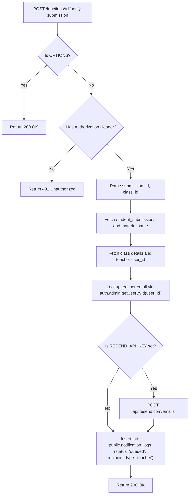

# Notify Submission Architecture

This document details the teacher alert pipeline, authorization model, and delivery tracking for `supabase/functions/notify-submission/`.

---

## 1. Submission Notification Pipeline



---

## 2. Interface Contracts & Invariants

### Invocation Payload:
```typescript
interface NotifySubmissionPayload {
  submission_id: string;
  class_id: string;
}
```

### Security & Invariants:
- **Teacher Email Resolution**: Teacher email is retrieved using `adminSupabase.auth.admin.getUserById(classItem.user_id)`, keeping teacher emails private from student clients.
- **Audit Entity**: Written with `notification_type = 'submission_turned_in'`, linking `submission_id`, `class_id`, and `material_id`.
