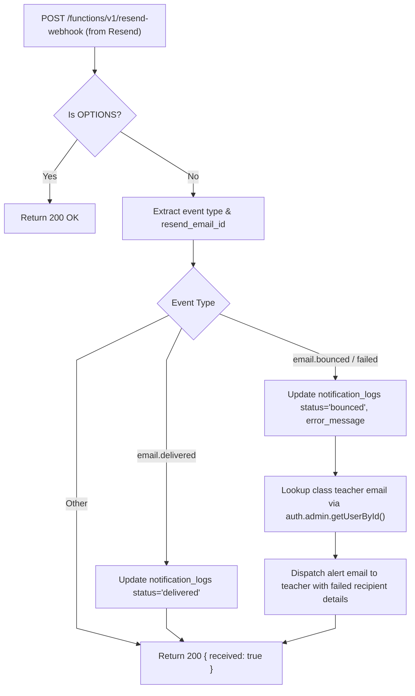

# Resend Webhook Architecture

This document details the webhook reception pipeline, delivery status transitions, and dead-letter alert mechanics for `supabase/functions/resend-webhook/`.

---

## 1. Webhook Lifecycle



---

## 2. Interface Contracts & Status Invariants

### Webhook Event Payload:
```typescript
interface ResendWebhookPayload {
  type: 'email.delivered' | 'email.bounced' | 'email.failed' | 'email.complained';
  data: {
    id?: string;
    email_id?: string;
    bounce?: {
      message?: string;
    };
  };
}
```

### Invariants:
- **Delivery Log State Transitions**:
  - `queued` $\rightarrow$ `delivered` (on successful MTA acceptance)
  - `queued` $\rightarrow$ `bounced` (on hard/soft bounce with diagnostic error message)
- **Teacher Escalation**: Upon detecting a bounce, the system alerts the classroom owner so student/parent email addresses can be corrected in `class_students`.
