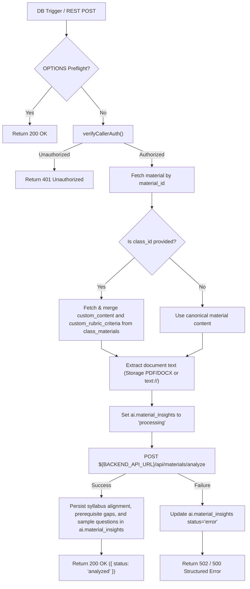

# Trigger Material Analysis Architecture

This document details the analysis pipeline, content merging, and backend orchestration for `supabase/functions/trigger-material-analysis/`.

---

## 1. Material Analysis Pipeline



---

## 2. Interface Contracts & Invariants

### Invocation Payload:
```typescript
interface MaterialAnalysisTriggerPayload {
  material_id: string;
  class_id?: string;
}
```

### Backend Forwarding Payload (`POST /api/materials/analyze`):
```typescript
interface BackendMaterialAnalyzePayload {
  material_text: string;
  material_name: string;
  category: string;
  tags?: string[];
  rubric_criteria?: Array<any>;
}
```

### Invariants:
- **Class-Scoped Customization Preservation**: If invoked with a `class_id`, class-private content overlays and modified rubric criteria are merged into the payload without mutating the canonical template material.
- **Asynchronous Safe Return**: Failures during LLM analysis preserve existing insights and flag `status = 'error'` with descriptive error logs.
