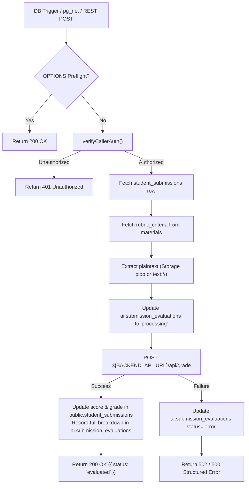

# Trigger Submission Evaluation Architecture

This document details the event-driven submission grading pipeline, request contracts, and backend AI integration for `supabase/functions/trigger-submission-evaluation/`.

---

## 1. Event Pipeline & Sequence



---

## 2. Interface Contracts & Invariants

### Invocation Payload:
```typescript
interface SubmissionEvaluationTriggerPayload {
  submission_id: string;
  class_id?: string;
  material_id?: string;
  student_id?: string;
}
```

### Backend Forwarding Payload (`POST /api/grade`):
```typescript
interface BackendGradePayload {
  submission_text: string;
  material_title: string;
  max_score: number;
  rubric_criteria: Array<{
    id: string;
    name: string;
    description: string;
    max_score: number;
    weight: number;
  }>;
}
```

### Security & Invariants:
- **Authorization Verification**: Calls `verifyCallerAuth(req, class_id)` supporting both database webhooks (service role) and teacher-triggered manual re-grading.
- **Transactional Score Synchronization**: Database trigger `trg_sync_student_scores` automatically fires upon updating `student_submissions.score`, updating composite gradebook standings.
