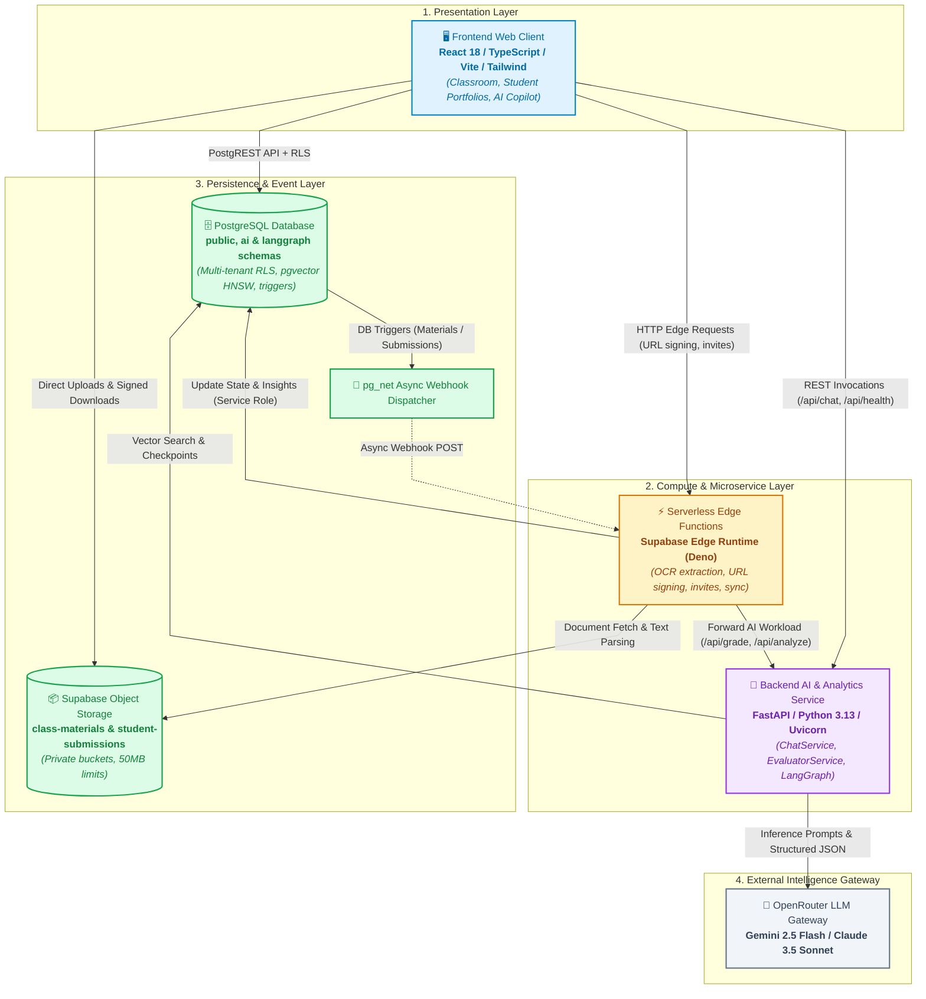
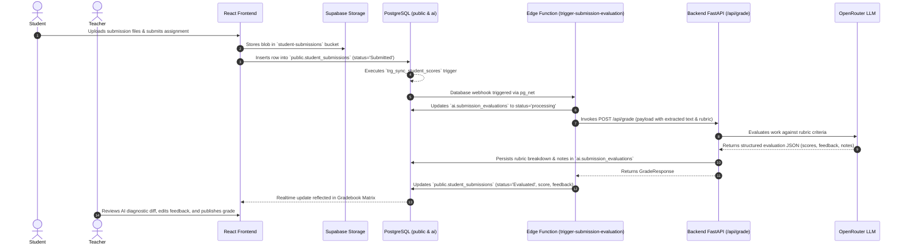
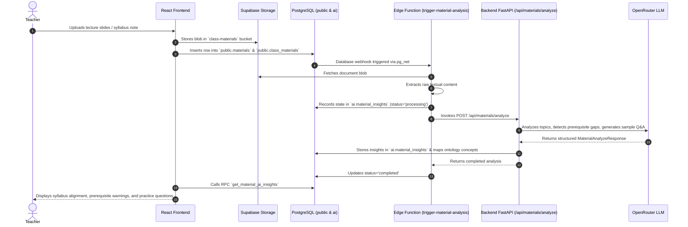

# Teach&Learn Subsystems Documentation

Welcome to the comprehensive subsystems documentation for **Teach&Learn**, an AI-powered full-stack workspace designed for educators to manage classes, track student portfolios, build repeatable curriculum templates, evaluate rubric criteria, and perform pedagogical gap analyses via LangGraph/RAG assistants.

---

## 🗺️ Subsystem Architecture Map

The Teach&Learn platform is architected as a set of decoupled, specialized subsystems cooperating across client-side UI, serverless edge computing, backend AI orchestration, and multi-tenant database layers:

---

## 📚 Subsystems Index & Deep Dive Guides

Explore detailed subsystem specifications, data contracts, and architectural designs:

| Subsystem Document | Primary Technologies | Key Responsibilities |
| :--- | :--- | :--- |
| [**`database_and_storage.md`**](file:///home/victor/antigravity/Teacher-Assistant-Workspace/systems/database_and_storage.md) | PostgreSQL 15+, Supabase RLS, Storage Buckets, `pg_trgm`, `pgcrypto` | Relational multi-tenancy, Row Level Security (RLS) policies, atomic RPC helper functions (`delete_material`, `unlink_material_from_class`, `delete_submission_atomic`), score recalculation triggers (`trg_sync_student_scores`), and reference-counted storage blob lifecycles. |
| [**`ai_and_ontology_subsystem.md`**](file:///home/victor/antigravity/Teacher-Assistant-Workspace/systems/ai_and_ontology_subsystem.md) | `pgvector` (HNSW), LangChain Core, OpenRouter, Ontological Graph | Autonomous student submission grading (`/api/grade`), material syllabus analysis & prerequisite gap detection (`/api/materials/analyze`), interactive RAG chat with dynamic data visualizations (`/api/chat`), and pedagogical concept mastery tracking. |
| [**`backend_service.md`**](file:///home/victor/antigravity/Teacher-Assistant-Workspace/systems/backend_service.md) | Python 3.13, FastAPI, Uvicorn, Pydantic v2, LangGraph, uv | REST API routing, structured LLM prompt formatting, JSON response parsing and validation, LangGraph state persistence, and BasedPyright-verified type safety. |
| [**`edge_functions.md`**](file:///home/victor/antigravity/Teacher-Assistant-Workspace/systems/edge_functions.md) | Deno, TypeScript, Supabase Edge Runtime, PDF/Doc Parsers | Event-driven webhook processing (`trigger-submission-evaluation`, `trigger-material-analysis`), serverless document OCR text extraction, secure short-lived signed URL generation, and student invitation tokens. |
| [**`frontend_architecture.md`**](file:///home/victor/antigravity/Teacher-Assistant-Workspace/systems/frontend_architecture.md) | React 18, Vite, TypeScript, Tailwind CSS, Lucide Icons | Single-Page Application (SPA) architecture, custom state hooks (`useClassOperations`, `useWorkspaceData`, `useAIChat`), feature modularity (`classroom`, `students`, `ai-assistant`), and interactive rubric/diagnostic modals. |
| [**`devops_and_deployment.md`**](file:///home/victor/antigravity/Teacher-Assistant-Workspace/systems/devops_and_deployment.md) | Docker, Docker Compose, Nginx Unprivileged, Vercel, Bash | Rootless container orchestration (`USER 1000:1000`), immutable production file permissions (`0555`/`0444`), unified single-container alternative host, database provisioning automation, and environment cascading. |
| [**`workflows/`**](file:///home/victor/antigravity/Teacher-Assistant-Workspace/systems/workflows/README.md) | Complete Full-Stack Workflows | Start-to-finish lifecycle guides for adding templates, creating classes from templates, uploading materials, student enrollment & attendance, submission turn-in & AI grading, and RAG copilot interactions. |
| [**`workflows-atomic/`**](file:///home/victor/antigravity/Teacher-Assistant-Workspace/systems/workflows-atomic/README.md) | Atomic Task Specifications | Granular, single-responsibility operational task specifications from trigger to conclusion, with event-driven AI pipelines treated as decoupled standalone workflows. |

---

## 🔄 End-to-End System Lifecycles

### 1. Student Submission & Autonomous AI Grading Flow

### 2. Educational Material Upload & Pedagogical Gap Analysis Flow

---

## 🛡️ Cross-Cutting System Invariants

1. **Strict Multi-Tenant Isolation**:
   - Every database query is guarded by PostgreSQL Row Level Security (RLS) using `auth.uid()`.
   - Teachers access only classes and materials they own or manage.
   - Students access only classes where they are actively enrolled.
2. **Immutable Containers & Principle of Least Privilege**:
   - Both frontend (Nginx) and backend (FastAPI/Uvicorn) execute as non-root user `1000:1000`.
   - Production container images enforce read-only source files (`0444`) and directories (`0555`).
3. **Strict Schema & Type Contracts**:
   - Schema single source of truth in PostgreSQL (`schema/schema-db.sql`, `schema/schema-ai.sql`).
   - Automated type synchronization via `scripts/_generate_types.py` producing strict TypeScript definitions (`frontend/src/types/db.ts`) and Pydantic models (`backend/src/types/db.py`).
4. **Resilient AI Processing**:
   - Robust fallback algorithms in `EvaluatorService` and `ChatService` ensuring structured JSON outputs even with varying LLM model outputs.
   - Non-blocking asynchronous processing for background AI tasks via database triggers and serverless Edge Functions.
