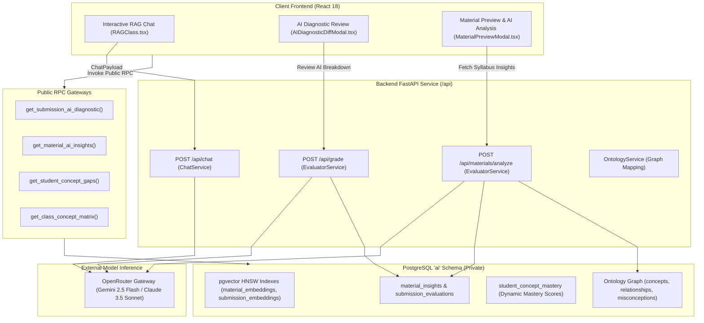
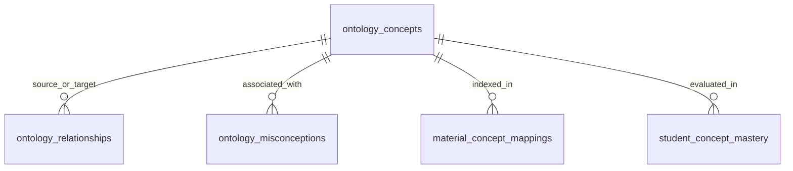
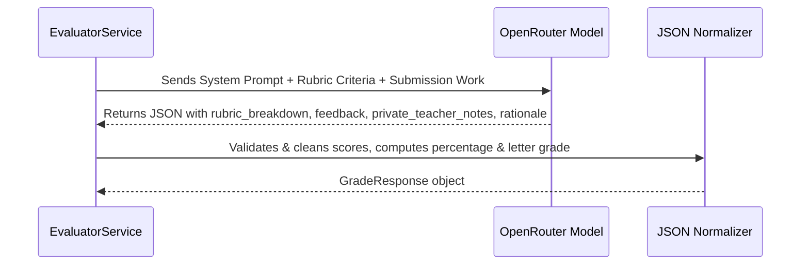

# AI, Vector Search & Ontological Knowledge Subsystem

The **AI, Vector Search & Ontological Knowledge Subsystem** powers the intelligent capabilities of the Teach&Learn platform. It combines dense semantic retrieval (`pgvector`), structured pedagogical knowledge graphs (`ai` schema), autonomous grading pipelines, and interactive Retrieval-Augmented Generation (RAG) chat assistants.

---

## 1. Architectural Overview



---

## 2. Private `ai` Schema DDL & Vector Storage

To ensure complete data protection, the `ai` schema is kept private from public PostgREST API exposure. All frontend data access occurs through vetted public RPC gateway functions.

### 2.1 Vector Store Embeddings (`pgvector` + HNSW)
The schema maintains dense 1536-dimensional semantic embeddings indexed using Hierarchical Navigable Small World (HNSW) graphs with cosine distance metrics:

```sql
-- Material Document Chunks & Embeddings
CREATE TABLE IF NOT EXISTS ai.material_embeddings (
    id UUID PRIMARY KEY DEFAULT gen_random_uuid(),
    material_id UUID NOT NULL REFERENCES public.materials(id) ON DELETE CASCADE,
    chunk_index INTEGER NOT NULL,
    chunk_content TEXT NOT NULL,
    token_count INTEGER,
    embedding extensions.vector(1536),
    metadata JSONB DEFAULT '{}'::jsonb,
    created_at TIMESTAMPTZ NOT NULL DEFAULT timezone('utc'::text, now())
);

CREATE INDEX IF NOT EXISTS idx_ai_mat_embed_hnsw 
ON ai.material_embeddings USING hnsw (embedding extensions.vector_cosine_ops);

-- Student Submission Chunks & Embeddings
CREATE TABLE IF NOT EXISTS ai.submission_embeddings (
    id UUID PRIMARY KEY DEFAULT gen_random_uuid(),
    submission_id UUID NOT NULL REFERENCES public.student_submissions(id) ON DELETE CASCADE,
    chunk_index INTEGER NOT NULL,
    chunk_content TEXT NOT NULL,
    token_count INTEGER,
    embedding extensions.vector(1536),
    metadata JSONB DEFAULT '{}'::jsonb,
    created_at TIMESTAMPTZ NOT NULL DEFAULT timezone('utc'::text, now())
);

CREATE INDEX IF NOT EXISTS idx_ai_sub_embed_hnsw 
ON ai.submission_embeddings USING hnsw (embedding extensions.vector_cosine_ops);
```

---

### 2.2 Ontological Knowledge Graph Tables
The ontological graph represents academic standards, conceptual dependencies, and student misconceptions:



1. **`ai.ontology_concepts`**:
   - Represents subject learning objectives and concepts (`id`, `subject`, `code`, `name`, `description`, `bloom_level`, `parent_concept_id`, `metadata`).
2. **`ai.ontology_relationships`**:
   - Directed knowledge graph edges connecting concepts (`source_concept_id`, `target_concept_id`, `relationship_type`, `weight`, `metadata`).
   - `relationship_type` includes `'prerequisite_of'`, `'builds_upon'`, `'relates_to'`, `'assesses'`.
3. **`ai.ontology_misconceptions`**:
   - Catalog of known pedagogical traps and misunderstandings (`concept_id`, `title`, `description`, `remedial_strategy`).
4. **`ai.material_concept_mappings`**:
   - Junction connecting material text chunks to ontological concepts with a relevance weight (`0.0` to `1.0`).
5. **`ai.student_concept_mastery`**:
   - Tracks dynamic concept mastery per student per class (`student_id`, `class_id`, `concept_id`, `mastery_score`, `confidence`, `status`, `evidence_submission_ids`).
   - `status`: `'mastered'` ($\ge 0.85$), `'practicing'` ($0.65 - 0.84$), `'gap_detected'` ($< 0.65$).

---

## 3. AI Service Pipelines (`EvaluatorService` & `ChatService`)

### 3.1 Autonomous Submission Evaluation (`/api/grade`)
Evaluates student work against multiple rubric criteria, calculates weighted scores, generates constructive feedback, and logs private teacher notes:



#### JSON Response Schema:
```json
{
  "submission_id": "3fa85f64-5717-4562-b3fc-2c963f66afa6",
  "score": 92.5,
  "max_score": 100.0,
  "grade": "A (93%)",
  "feedback": "Strong analytical structure and clear explanation of core concepts.",
  "private_teacher_notes": "Student demonstrated advanced mastery of Bloom Level 4 synthesis.",
  "rubric_breakdown": [
    {
      "criterionId": "crit-1",
      "criterionName": "Conceptual Understanding",
      "score": 48.0,
      "maxScore": 50.0,
      "comment": "Accurately applied primary principles."
    },
    {
      "criterionId": "crit-2",
      "criterionName": "Clarity & Argumentation",
      "score": 44.5,
      "maxScore": 50.0,
      "comment": "Well-supported arguments with minor formatting issues."
    }
  ],
  "rationale": "High score earned across both criteria with strong supporting evidence.",
  "status": "completed",
  "model_used": "google/gemini-2.5-flash"
}
```

---

### 3.2 Material Analysis & Gap Detection (`/api/materials/analyze`)
Performs pedagogical analysis of uploaded syllabus documents and study materials:
1. **Syllabus Alignment**: Identifies core academic topics, learning standard codes, and alignment confidence.
2. **Prerequisite Knowledge Gaps**: Pinpoints missing prerequisite assumptions with recommended remedial actions.
3. **Sample Question Generation**: Synthesizes multiple-choice questions with answers, explanations, and difficulty ratings (`Beginner`, `Intermediate`, `Advanced`).

---

### 3.3 Interactive RAG Teacher Assistant (`/api/chat`)
The interactive assistant compiles classroom metadata, student rosters, running gradebook statistics, and active session configurations into the prompt context:

#### Assistant Output Format:
The assistant produces a structured JSON payload containing rich markdown text and optional interactive visualization widgets:
```json
{
  "text": "### Performance Summary\nStudent John Doe has improved by 14% over the last term...",
  "visualization": {
    "type": "ranking",
    "title": "Top Performing Students in Module 3",
    "description": "Student score vs. class average comparison",
    "data": [
      {"name": "John Doe", "score": 94.5, "classAvg": 82.0, "status": "Advanced"},
      {"name": "Jane Smith", "score": 88.0, "classAvg": 82.0, "status": "Proficient"}
    ]
  }
}
```

Supported visualization types rendered by `Visualizer.tsx`:
- `charts`: Comparative bar charts and distribution histograms.
- `heatmap`: Topic-by-topic class mastery heatmaps.
- `ranking`: Ranked student performance vs. class averages.
- `timeline`: Longitudinal grade trajectory over time.
- `stats`: Key metric cards and aggregate KPI badges.

---

## 4. Public Gateway RPC Functions

To securely bridge the private `ai` schema to the client frontend, the database provides security-definer RPC functions:

| Function Name | Parameters | Output Payload |
| :--- | :--- | :--- |
| `get_submission_ai_diagnostic` | `p_submission_id UUID` | Returns evaluation status, breakdown criteria, private notes, and rationale. |
| `get_material_ai_insights` | `p_material_id UUID` | Returns syllabus alignment, prerequisite gap list, and sample Q&A. |
| `get_student_concept_gaps` | `p_student_id UUID, p_class_id UUID` | Returns array of concepts with `status = 'gap_detected'` and remedial recommendations. |
| `get_class_concept_matrix` | `p_class_id UUID` | Aggregates class-wide concept mastery percentages across all enrolled students. |
