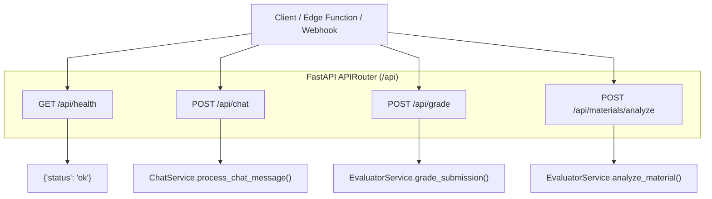
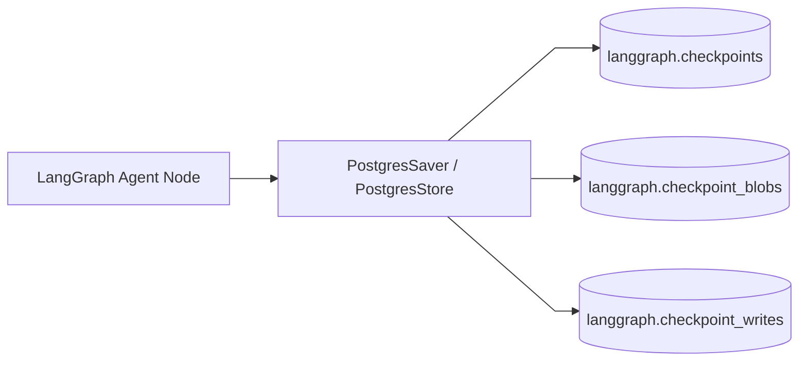

# Backend Service Architecture (FastAPI & LangChain)

The **Backend Service Subsystem** is an asynchronous Python 3.13 application powered by **FastAPI**, **LangChain Core**, **Pydantic v2**, and **Uvicorn**. It handles RESTful API endpoints, prompt serialization, model invocation through OpenRouter, structured LLM JSON extraction, and LangGraph persistent state management.

---

## 1. Directory Layout & Module Architecture

```
backend/
├── Dockerfile                  # Production multi-stage rootless container definition
├── pyproject.toml              # Dependencies managed via uv (Python 3.13, FastAPI, LangChain)
├── entrypoint.sh               # Container startup script verifying environment parameters
└── src/
    ├── main.py                 # FastAPI application factory, CORS middleware, and router mounting
    ├── server/
    │   └── router.py           # APIRouter defining /api/health, /api/chat, /api/grade, /api/materials/analyze
    ├── service/
    │   ├── chat.py             # ChatService coordinating context formatting and LLM conversation flows
    │   ├── evaluator.py        # EvaluatorService performing grading and curriculum gap analysis
    │   └── ontology.py         # OntologyService managing knowledge graph nodes and student mastery
    ├── lib/
    │   ├── formatter.py        # String and context serializers for prompts
    │   ├── llm.py              # OpenRouter ChatOpenAI client factory and JSON parser
    │   └── logger.py           # Centralized structured logger
    └── types/
        ├── ai.py               # Pydantic models for grading, analysis, and ontological graph nodes
        ├── schemas.py          # Pydantic models for chat payloads, messages, and student portfolios
        └── db.py               # Auto-generated database table representations
```

---

## 2. API Endpoints Specification

All backend endpoints are scoped under the `/api` prefix:



### 2.1 Endpoint Contracts:

#### 1. `GET /api/health`
- **Purpose**: Liveness and readiness probe for Docker healthchecks and reverse proxy routing.
- **Response**: `{"status": "ok"}`

#### 2. `POST /api/chat`
- **Request Body**: `ChatPayload`
  - `messages`: Array of `Message` objects (`id`, `role`, `text`, `timestamp`).
  - `students`: Array of `StudentData` portfolios (scores, grades, submissions, attendance rates).
  - `classroom`: Classroom metadata (subject, grade level, teaching style, assessment preferences).
  - `newAnalysisConfig`: Active teacher directives (focus areas, tone, output preferences).
- **Response**: `dict` containing `"text"` (markdown summary) and optional `"visualization"` (JSON chart/ranking/heatmap/timeline model).

#### 3. `POST /api/grade`
- **Request Body**: `GradeRequest`
  - `submission_id`: UUID of student submission.
  - `material_name`: Title of assignment material.
  - `submission_text`: Raw extracted text of student's submitted document.
  - `rubric_criteria`: List of rubric items (`name`, `maxScore`, `description`).
  - `max_score`: Total maximum score.
- **Response**: `GradeResponse`
  - `score`: Total score awarded.
  - `max_score`: Maximum possible score.
  - `grade`: Formatted letter grade and percentage (e.g., `"A (92%)"`).
  - `feedback`: Student-facing constructive commentary.
  - `private_teacher_notes`: Internal teacher diagnostics and detected misconceptions.
  - `rubric_breakdown`: Per-criterion score allocations and notes.
  - `rationale`: Analytical explanation of evaluation decision.
  - `status`: `"completed"` | `"failed"`.
  - `model_used`: LLM identifier (e.g. `"google/gemini-2.5-flash"`).

#### 4. `POST /api/materials/analyze`
- **Request Body**: `MaterialAnalyzeRequest`
  - `material_id`: UUID of material.
  - `name`: Material title.
  - `category`: `public.content_category` enum.
  - `extracted_text`: Full document textual content.
- **Response**: `MaterialAnalyzeResponse`
  - `summary`: Executive pedagogical overview.
  - `difficulty_level`: `"Beginner"` | `"Intermediate"` | `"Advanced"`.
  - `syllabus_alignment`: Array of curriculum topics, standard codes, and alignment confidence.
  - `prerequisite_gaps`: Array of detected prerequisite knowledge gaps and recommended remedial actions.
  - `sample_questions`: Array of synthesized practice questions with options, explanations, and answers.
  - `status`: `"completed"`.

---

## 3. LLM Integration & Parser Subsystem (`src/lib/llm.py`)

The backend connects to external LLM providers via OpenRouter using LangChain's `ChatOpenAI`:

```python
def get_openrouter_llm(model: str, api_key: str, temperature: float = 0.2) -> ChatOpenAI:
    """Instantiate OpenRouter client with standardized base URL and timeout parameters."""
    return ChatOpenAI(
        model=model,
        openai_api_key=api_key,
        openai_api_base="https://openrouter.ai/api/v1",
        temperature=temperature,
        max_retries=3,
        request_timeout=60.0,
    )
```

### Resilient JSON Extraction:
LLM responses can occasionally wrap JSON in markdown blocks (` ```json ... ``` `) or include conversational preamble. The `parse_llm_response()` utility robustly isolates and parses JSON objects using regex delimiters and fallback cleaning routines.

---

## 4. Context Serialization Subsystem (`src/lib/formatter.py`)

To optimize prompt token density and maximize LLM comprehension:
- **`format_classroom_context()`**: Summarizes class subject, grade level, instructional rules, and teaching style.
- **`format_students_context()`**: Aggregates roster performance tiers, GPA distribution, attendance rates, and recent assignment grades into a compact tabular representation.
- **`format_analysis_config_context()`**: Injects active teacher preferences (e.g., focusing on at-risk students or prioritizing rubric alignment).

---

## 5. LangGraph State Persistence & Memory Architecture

For multi-turn agentic conversations and autonomous workflows, the backend connects to PostgreSQL checkpoint tables stored in the isolated `langgraph` schema:



- **Isolated Schema**: Tables reside in `langgraph` schema (`langgraph.checkpoints`, `langgraph.checkpoint_blobs`, `langgraph.checkpoint_writes`, `langgraph.store`), preventing agent execution metadata from cluttering domain tables in `public`.
- **Time-Travel & Resumption**: Checkpoint states allow reconstructing previous conversation turns, resuming interrupted tool executions, and maintaining conversation memory across browser sessions.
