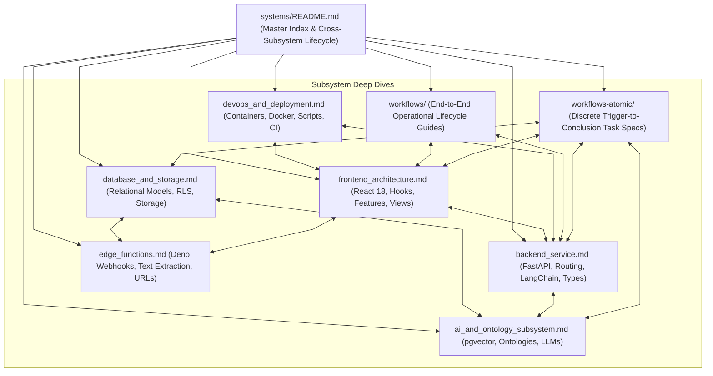

# Subsystems Documentation Architecture & Information Hierarchy

This document outlines the architectural organization, structural conventions, cross-referencing model, and maintenance standards for the documentation files residing in `systems/`.

---

## 1. Documentation Information Architecture

The `systems/` directory follows a modular decomposition pattern corresponding 1-to-1 with the major functional subsystems of the Teach&Learn platform:

---

## 2. Structural & Formatting Standards

Every subsystem document in `systems/` adheres to a uniform structure:
1. **Header & High-Level Overview**: Plain English executive summary of the subsystem's role.
2. **Subsystem Architecture Diagram**: Mermaid flowchart or sequence diagram depicting internal and external component flows.
3. **Data Contracts & Specifications**: Concrete TypeScript interfaces, Pydantic models, DDL excerpts, or API request/response JSON schemas.
4. **Security & Boundary Invariants**: Multi-tenant constraints, RLS enforcement, token verification, and non-root execution rules.
5. **Cross-References**: Direct file links pointing to the authoritative source code files implementing the documented features.

---

## 3. Cross-Subsystem Maintenance Contract

Whenever a source code file in any part of the repository is modified, created, or deprecated:
1. The relevant subsystem document in `systems/` **must be updated** if the change introduces new data models, endpoints, RPC functions, or architecture patterns.
2. Cross-cutting sequence diagrams in `systems/README.md` must be synchronized if the lifecycle workflow changes.
3. All file paths must be maintained as valid clickable markdown links using the `file:///` scheme.
