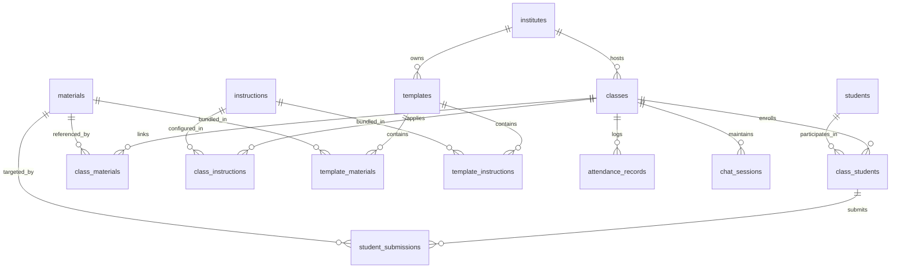
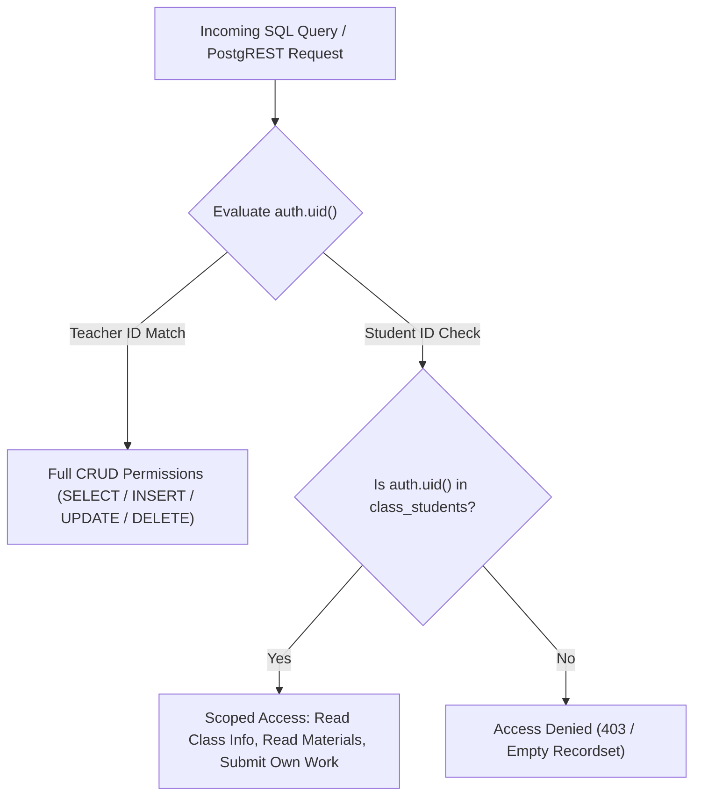

# Database & Storage Subsystem Architecture

The **Database & Storage Subsystem** provides the authoritative data persistence, multi-tenant isolation, relational data modeling, audit tracking, atomic deletion routines, and secure object storage for the Teach&Learn platform.

---

## 1. Architectural Overview

The persistence layer is built on **PostgreSQL 15+** managed via Supabase, complemented by **Supabase Storage** for large educational documents and student assignment uploads.

```mermaid
%%{init: {'flowchart': {'curve': 'linear'}}}%%
flowchart TD
    subgraph ClientAndServices["Clients & Microservices"]
        TeacherClient["Teacher Browser (Authenticated auth.uid())"]
        StudentClient["Student Browser (Authenticated auth.uid())"]
        BackendSvc["Backend FastAPI / LangChain Service"]
        EdgeFns["Deno Edge Functions (Service Role)"]
    end

    subgraph SecurityBoundary["Row Level Security & PostgreSQL Engine"]
        RLS["PostgreSQL RLS Engine (auth.uid())"]
        PublicSchema[("public Schema (Relational Entities)")]
        AISchema[("ai Schema (pgvector & Ontologies)")]
        LangGraphSchema[("langgraph Schema (Agent State Checkpoints)")]
        Triggers["Database Triggers (trg_sync_student_scores, moddatetime)"]
        RPCs["Secure RPCs (delete_material, unlink_material, etc.)"]
    end

    subgraph BlobStorage["Supabase Storage Layer"]
        MatBucket[("class-materials (50MB Limit, Private)")]
        SubBucket[("student-submissions (50MB Limit, Private)")]
    end

    TeacherClient -->|JWT Bearer + RLS| RLS
    StudentClient -->|JWT Bearer + RLS| RLS
    BackendSvc -->|Connection Pool (Postgres URI)| PublicSchema
    BackendSvc -->|LangGraph Checkpointer| LangGraphSchema
    EdgeFns -->|Service Role Key (Admin Bypass)| PublicSchema

    RLS --> PublicSchema
    RLS --> AISchema
    PublicSchema --> Triggers
    PublicSchema --> RPCs

    TeacherClient -->|Direct Upload (Teacher Path)| MatBucket
    StudentClient -->|Direct Upload (Material Path)| SubBucket
    EdgeFns -->|Blob Fetch & Text Extraction| MatBucket
    RPCs -->|Storage Path Cleanup Returns| BlobStorage
```

---

## 2. PostgreSQL Relational Model (`public` Schema)

### 2.1 Domain Enumerations (ENUMs)
The schema defines domain-specific PostgreSQL custom types to enforce semantic consistency at the database engine boundary:

| Enum Name | Allowed Values | Usage Context |
| :--- | :--- | :--- |
| `public.content_category` | `'Study Material'`, `'Note'`, `'Assigned Book'`, `'Link'`, `'Practical'`, `'Assignment'`, `'Test'`, `'Exam'` | Categorizes learning resources in materials and templates. |
| `public.content_type` | `'File'`, `'URL'`, `'Text'` | Describes storage format in JSONB content arrays. |
| `public.submission_status` | `'Assigned'`, `'Pending'`, `'Submitted'`, `'Evaluated'`, `'Graded'` | State progression for student assignments. |
| `public.attendance_status` | `'Present'`, `'Absent'`, `'Late'`, `'Excused'` | Daily or session-level student attendance. |
| `public.instruction_type` | `'System Persona'`, `'Grading Rubric'`, `'Lesson Plan Guideline'`, `'Material Generation Rule'`, `'Student Interaction Rule'`, `'Assessment Creation Rule'`, `'Content Filtering Rule'`, `'General Policy'` | Categorizes assistant behavioral instructions and grading rubrics. |
| `public.experience_level` | `'Beginner'`, `'Intermediate'`, `'Advanced'`, `'Mixed'` | Target proficiency level for classes and templates. |
| `public.teaching_style` | `'Lecture'`, `'Socratic Method'`, `'Interactive'`, `'Project-Based'`, `'Flipped Classroom'`, `'Discussion-Based'`, `'Hands-On'` | Pedagogical style configured for assistant prompting. |
| `public.assessment_preference` | `'Multiple Choice'`, `'Short Answer'`, `'Essays'`, `'Presentations'`, `'Single Project'`, `'Group Projects'`, `'Oral Exams'`, `'Peer Review'` | Default evaluation methodology. |

---

### 2.2 Relational Entity Schema & Foreign Keys



#### Core Entities:
1. **`institutes`**: Educational organization or institutional boundary (`id`, `name`, `type`, `settings`, `user_id`, `created_at`, `updated_at`).
2. **`classes`**: Active pedagogical course instances (`id`, `institute_id`, `teacher_id`, `name`, `subject`, `grade_level`, `experience_level`, `teaching_style`, `assessment_preference`, `term`, `schedule`, `settings`, `created_at`, `updated_at`).
3. **`templates`**: Reusable curriculum blueprints that can instantiate new classes (`id`, `institute_id`, `name`, `subject`, `grade_level`, `experience_level`, `teaching_style`, `assessment_preference`, `settings`, `user_id`, `created_at`, `updated_at`).
4. **`students`**: Master student identity registry (`id`, `user_id`, `name`, `email`, `avatar_url`, `enrollment_number`, `parent_contact`, `created_at`, `updated_at`).
5. **`materials`**: Global repository of learning resources and assignments (`id`, `name`, `description`, `category`, `content` JSONB, `user_id`, `created_at`, `updated_at`).
6. **`instructions`**: Assistant prompts, system personas, and grading rubrics (`id`, `title`, `description`, `type`, `content`, `user_id`, `created_at`, `updated_at`).

#### Junction & Execution Entities:
1. **`class_students`**: Class enrollment junction linking `class_id` and `student_id`, storing calculated running metrics (`current_score`, `current_grade`, `performance_tier`, `attendance_rate`, `status`, `joined_at`).
2. **`class_materials`**: Connects reusable `material_id` to `class_id` with ordering indices (`order_index`) and class-specific availability constraints.
3. **`class_instructions`**: Connects system instructions or rubrics to `class_id` with execution priority (`order_index`).
4. **`student_submissions`**: Student work records targeting an assignment material (`id`, `class_id`, `student_id`, `material_id`, `status`, `score`, `max_score`, `feedback`, `content` JSONB, `submitted_at`, `evaluated_at`).
5. **`attendance_records`**: Session-level attendance tracking (`id`, `class_id`, `student_id`, `date`, `status`, `notes`, `recorded_by`).
6. **`chat_sessions`**: Persisted conversation sessions between teachers and the AI Assistant (`id`, `class_id`, `user_id`, `title`, `messages` JSONB, `analysis_config` JSONB, `created_at`, `updated_at`).

---

## 3. Row Level Security (RLS) & Multi-Tenant Access Model

PostgreSQL Row Level Security is enabled on **all application tables**.



### RLS Policies Summary:
- **Teacher Ownership**: Teachers (`auth.uid() = teacher_id` or `auth.uid() = user_id`) have complete administrative control over their institutes, classes, curriculum materials, instructions, and student records.
- **Enrolled Student Read Access**: Students whose `auth.uid()` matches `students.user_id` enrolled in `class_students` can `SELECT` classes, linked `class_materials`, and view active announcements.
- **Submission Guarding**: Students can only `INSERT` and `UPDATE` submissions where `student_id` resolves to their own record, and cannot modify teacher-assigned `score` or `feedback`.
- **Foreign Key Indexing Requirement**: To guarantee that RLS subqueries do not degrade under high multi-tenant load, **every foreign key column in the schema is backed by an explicit B-Tree index** (e.g. `idx_classes_teacher_id`, `idx_class_students_class_id`, `idx_class_materials_material_id`).

---

## 4. Automated Database Triggers

### 4.1 Gradebook Score Synchronization Trigger (`trg_sync_student_scores`)
Whenever a student submission is inserted, deleted, or has its score updated, this trigger automatically recomputes the student's overall weighted average, assigns a letter grade, and updates their performance tier in `public.class_students`:

```sql
CREATE OR REPLACE FUNCTION public.sync_student_class_scores()
RETURNS TRIGGER AS $$
DECLARE
    v_class_id UUID;
    v_student_id UUID;
    v_avg_score NUMERIC;
    v_grade TEXT;
    v_tier TEXT;
BEGIN
    v_class_id := COALESCE(NEW.class_id, OLD.class_id);
    v_student_id := COALESCE(NEW.student_id, OLD.student_id);

    -- Calculate current weighted average
    SELECT AVG((score / NULLIF(max_score, 0)) * 100)
    INTO v_avg_score
    FROM public.student_submissions
    WHERE class_id = v_class_id AND student_id = v_student_id AND score IS NOT NULL;

    -- Compute letter grade & performance tier
    IF v_avg_score >= 90 THEN v_grade := 'A'; v_tier := 'Advanced';
    ELSIF v_avg_score >= 80 THEN v_grade := 'B'; v_tier := 'Proficient';
    ELSIF v_avg_score >= 70 THEN v_grade := 'C'; v_tier := 'Developing';
    ELSIF v_avg_score IS NOT NULL THEN v_grade := 'D'; v_tier := 'Critical Support';
    ELSE v_grade := 'N/A'; v_tier := 'Unassessed';
    END IF;

    UPDATE public.class_students
    SET current_score = ROUND(v_avg_score, 2),
        current_grade = v_grade,
        performance_tier = v_tier,
        updated_at = timezone('utc'::text, now())
    WHERE class_id = v_class_id AND student_id = v_student_id;

    RETURN NEW;
END;
$$ LANGUAGE plpgsql SECURITY DEFINER;
```

---

## 5. Atomic Stored Procedures (RPCs)

The database exposes atomic RPC helper functions for clean, multi-table cascade operations:

1. **`unlink_material_from_class(p_class_id UUID, p_material_id UUID)`**:
   - Removes the `class_materials` link without deleting the underlying material or past student submissions.
2. **`delete_material(p_material_id UUID)`**:
   - Deletes the material record and uses cross-material reference counting across all `content` JSONB arrays. Only returns physical storage paths for deletion if no other material or class references that physical file.
3. **`delete_submission_atomic(p_submission_id UUID)`**:
   - Atomically drops submission rows and returns the physical blob storage paths for backend or frontend storage bucket deletion.
4. **`archive_material(p_material_id UUID)`**:
   - Marks material status as archived, decoupling it from active class assignments.

---

## 6. Supabase Storage Architecture

Two dedicated private storage buckets isolate teacher curriculum assets from student assignment submissions:

```mermaid
%%{init: {'flowchart': {'curve': 'linear'}}}%%
flowchart LR
    subgraph BucketMaterials["Bucket: class-materials (Private)"]
        MatPath["Path: /{teacher_user_id}/{material_id}/{content_item_id}"]
    end

    subgraph BucketSubmissions["Bucket: student-submissions (Private)"]
        SubPath["Path: /{material_id}/{content_item_id}"]
    end

    Teacher["Teacher"] -->|Direct Upload / Delete| BucketMaterials
    Student["Student"] -->|Direct Upload (Own Work)| BucketSubmissions
    Student -->|Signed URL via get-material-url| BucketMaterials
    Teacher -->|Review Submission Work| BucketSubmissions
```

### Storage Invariants:
- **File Size Limit**: Strict 50MB per file boundary configured in `bucket-materials.sql` and `bucket-submissions.sql`.
- **MIME Type Allowlist**: Restricted to `.pdf`, `.docx`, `.pptx`, `.txt`, `.csv`, `.png`, `.jpg`, `.jpeg`.
- **Private Access Control**: Direct public URLs are disabled. Students access private curriculum files via short-lived signed URLs generated through the `get-material-url` Edge Function upon verifying active enrollment in `class_students`.
