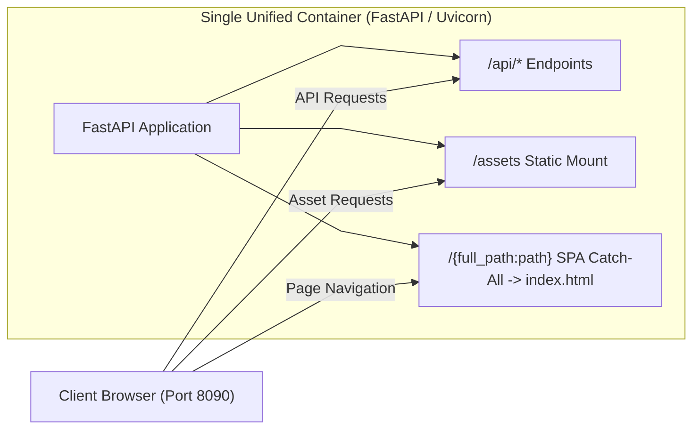
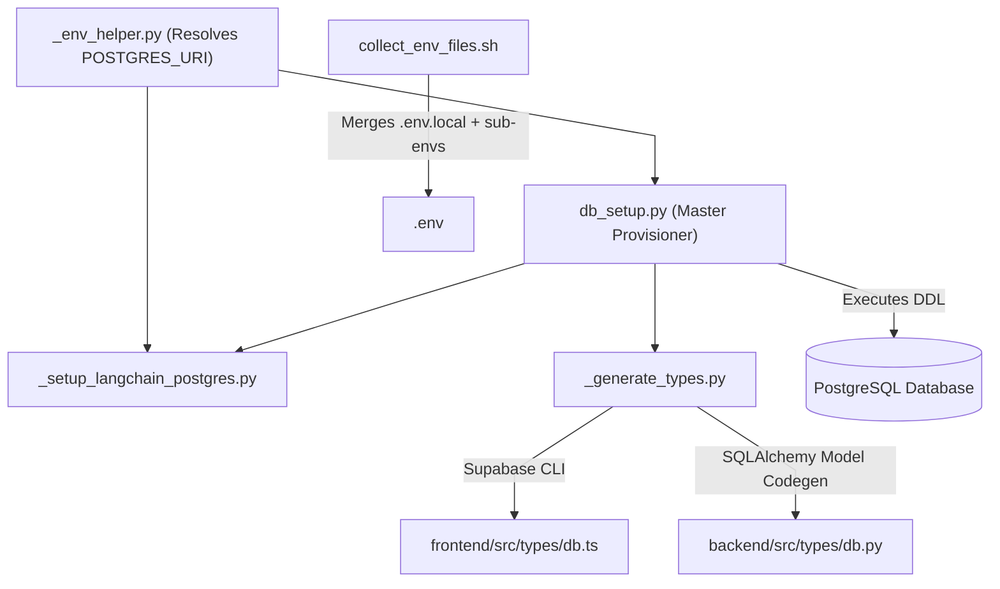

# DevOps, Deployment & Containerization Subsystem

The **DevOps, Deployment & Containerization Subsystem** governs multi-container orchestration, rootless container security, build pipelines, database provisioning automation, static edge hosting, and environment variable synchronization across the Teach&Learn platform.

---

## 1. Multi-Container Orchestration Architecture

The workspace utilizes **Docker Compose** to coordinate decoupled frontend and backend services in development and production environments:

```mermaid
%%{init: {'flowchart': {'curve': 'linear'}}}%%
flowchart TD
    subgraph DockerHost["Docker Host Network"]
        subgraph FrontendService["Frontend Container (Port 80)"]
            Nginx["Nginx Unprivileged (USER 1000:1000)"]
            HTML["Vite React Bundle (/usr/share/nginx/html)"]
            Nginx --> HTML
        end

        subgraph BackendService["Backend Container (Port 8090)"]
            Uvicorn["Uvicorn / FastAPI (USER 1000:1000)"]
            PyApp["Python 3.13 / LangChain Service (/app)"]
            Uvicorn --> PyApp
        end
    end

    Client["Browser Client"] -->|HTTP / SPA Navigation (Port 80)| Nginx
    Client -->|REST API / CORS (Port 8090)| Uvicorn
    Nginx -.->|Reverse Proxy / Direct| Uvicorn
```

### 1.1 Compose Configurations:
1. **`docker-compose.yml` (Base Production Deployment)**:
   - Configures non-root user execution (`user: "1000:1000"`).
   - Injects healthcheck directives for both containers.
   - Restricts port bindings to `80:80` (Frontend) and `8090:8090` (Backend).
   - Enforces production environment variables via `.env`.
2. **`docker-compose.dev.yml` (Local Development Layer)**:
   - Overlays bind mounts from host directories (`./frontend:/app`, `./backend:/app`) to enable live hot-reloading for Vite and Uvicorn (`--reload`).
   - Mounts anonymous volumes for container-internal `node_modules` and Python `.venv` to prevent host OS binary conflicts.

---

## 2. Container Security & Immutability Standards

The Teach&Learn workspace implements strict container hardening standards:

1. **Rootless Container Execution**:
   - Both the frontend Nginx image (`nginxinc/nginx-unprivileged:alpine`) and the backend Python image execute as unprivileged UID/GID `1000:1000`.
   - Prevents container escape privilege escalation vulnerabilities.
2. **Immutable Production File Permissions**:
   - Production Dockerfile layers enforce read-only permissions across source assets:
     - Directories mapped to `0555` (read + execute).
     - Source files mapped to `0444` (read-only).
   - Prevents runtime tampering or unauthorized file modification inside containers.
3. **Multi-Stage Builds**:
   - Frontend: Node.js build stage compiles static assets, discarding build tooling in the final minimal Nginx runtime image.
   - Backend: uv build stage installs Python dependencies, discarding compilation toolchains in the final runtime container.

---

## 3. Alternative Unified Hosting Strategy (`alternative-host/`)

For lightweight or single-instance cloud environments, the `alternative-host/` directory provides a self-contained unified hosting model that bundles the compiled React frontend directly inside the FastAPI backend container:



- **`deploy.sh`**: Runs `npm run build` in `frontend/` and syncs the distribution bundle to `alternative-host/workdir/dist`.
- **`main.py`**: Mounts `/assets` via `StaticFiles` and serves `index.html` on any non-API route to maintain client-side SPA routing.

---

## 4. Automation & Provisioning Scripts (`scripts/`)

The `scripts/` directory contains CLI automation tools for database lifecycle, LangGraph initialization, type generation, and environment configuration:



### Automation Tools:
1. **`db_setup.py`**:
   - Connects via `psycopg`, executes `schema-reset.sql`, `schema-db.sql`, and `schema-ai.sql` in strict dependency sequence.
   - Automatically invokes LangGraph checkpointer initialization and type generation.
2. **`_setup_langchain_postgres.py`**:
   - Configures PostgreSQL tables and checkpointer schemas for LangGraph using `PostgresSaver` and `PostgresStore`.
3. **`_generate_types.py`**:
   - Uses the Supabase CLI (`supabase gen types typescript`) to generate `frontend/src/types/db.ts` and maps relational schemas into `backend/src/types/db.py`.
4. **`collect_env_files.sh`**:
   - Aggregates environment variables from `.env.local`, `frontend/.env`, and `backend/.env` into a single consolidated root `.env` file for Docker Compose.

---

## 5. Serverless Multi-Service Hosting (Vercel)

For external serverless deployments, `vercel.json` orchestrates both the Vite frontend and Python FastAPI backend as distinct services with edge rewrites:

```json
{
  "$schema": "https://openapi.vercel.sh/vercel.json",
  "services": {
    "frontend": {
      "root": "frontend/",
      "framework": "vite"
    },
    "backend": {
      "root": "backend/",
      "entrypoint": "src.main:app"
    }
  },
  "rewrites": [
    {
      "source": "/api/:path*",
      "destination": {
        "service": "backend"
      }
    },
    {
      "source": "/(.*)",
      "destination": {
        "service": "frontend"
      }
    }
  ]
}
```

This configuration ensures:
1. **REST API Routing**: All `/api/*` HTTP requests are directed to the FastAPI service (`backend/src.main:app`).
2. **SPA Client Routing**: All web and deep client-side routes (`/(.*)`) are resolved by the Vite React SPA (`frontend/`).

### 5.1 Ignored Build Step Filtering (`bash-decide.sh`)

To prevent unnecessary serverless builds and save Vercel build minutes, [`bash-decide.sh`](file:///home/victor/antigravity/Teacher-Assistant-Workspace/bash-decide.sh) is configured as the Vercel **Ignored Build Step** command:

1. **Branch Filter**: Builds only run on `preview`, `main`, and `master` branches. Other branches exit with code `0` (skipping deployment).
2. **First-Time Deployment**: If `$VERCEL_GIT_PREVIOUS_SHA` is unset, it proceeds with build (exit code `1`).
3. **Targeted Diff Detection**: Compares `$VERCEL_GIT_PREVIOUS_SHA` against `HEAD` scoping `frontend/`, `backend/`, and `vercel.json`:
   - If diff is empty (e.g., changes only touch docs, root configs, or scratch files): exits `0` (deployment skipped).
   - If changes are detected in deployable code or configuration: exits `1` (deployment proceeds).
