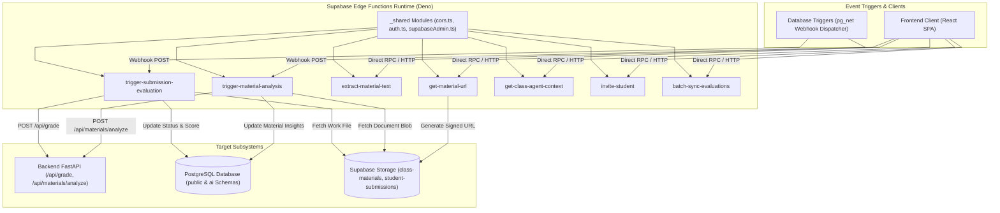

# Supabase Edge Functions Subsystem Architecture

The **Edge Functions Subsystem** contains serverless TypeScript microservices running on the **Deno** runtime within Supabase Edge Infrastructure. It handles asynchronous event-driven webhooks, text extraction from uploaded storage objects, secure signed URL generation, student invitations, and AI context assembly.

---

## 1. Subsystem Architecture & Flow

---

## 2. Shared Modules (`_shared/`)

The `_shared/` directory provides common reusable utilities across all edge endpoints:

1. **`cors.ts`**:
   - Implements standardized Cross-Origin Resource Sharing (CORS) headers:
     - `Access-Control-Allow-Origin: *`
     - `Access-Control-Allow-Headers: authorization, x-client-info, apikey, content-type`
     - `Access-Control-Allow-Methods: POST, GET, OPTIONS, PUT, DELETE`
   - Handles `OPTIONS` HTTP preflight requests returning HTTP 200 immediately.
2. **`auth.ts`**:
   - Parses the `Authorization: Bearer <JWT>` header.
   - Validates tokens using `supabase.auth.getUser(token)` to extract authenticated `user_id` and ensure authorization before executing sensitive queries.
3. **`supabaseAdmin.ts`**:
   - Instantiates a high-privilege `SupabaseClient` using `SUPABASE_SERVICE_ROLE_KEY`.
   - Used for administrative updates (such as updating `ai.submission_evaluations` or generating signed storage download URLs for enrolled students).

---

## 3. Edge Functions Catalog & Dataflows

### 3.1 `trigger-submission-evaluation`
- **Trigger**: Database Webhook fired when a new submission row is inserted or set to `status = 'Submitted'` in `public.student_submissions`.
- **Workflow**:
  1. Parses submission ID and class rubric configuration from the webhook payload.
  2. Downloads the submitted file from `student-submissions` bucket and extracts its text.
  3. Inserts a record into `ai.submission_evaluations` with `status = 'processing'`.
  4. Calls Backend `POST /api/grade` with the extracted text, material title, and rubric criteria.
  5. Updates `public.student_submissions` with the calculated score, grade, and feedback.
  6. Updates `ai.submission_evaluations` with full rubric criteria breakdowns and private teacher notes.

---

### 3.2 `trigger-material-analysis`
- **Trigger**: Database Webhook fired when a new educational resource is inserted or updated in `public.materials`.
- **Workflow**:
  1. Downloads document blobs (PDFs, presentations, notes) from `class-materials`.
  2. Extracts raw textual content.
  3. Records entry in `ai.material_insights` with `status = 'processing'`.
  4. Invokes Backend `POST /api/materials/analyze`.
  5. Persists syllabus alignment mappings, prerequisite gap warnings, and sample questions into `ai.material_insights`.
  6. Maps extracted concepts to `ai.ontology_concepts` in the knowledge graph.

---

### 3.3 `extract-material-text`
- **Trigger**: Client HTTP POST request containing storage bucket path or binary upload.
- **Workflow**:
  - Parses binary streams (PDF, DOCX, TXT, Markdown).
  - Returns sanitized plaintext string suitable for LLM prompt context ingestion and dense embedding vector generation.

---

### 3.4 `get-material-url`
- **Trigger**: Client HTTP POST requesting access to a private curriculum file.
- **Security Check**:
  - Validates requester's JWT.
  - Queries `class_students` to ensure the student is actively enrolled in a class referencing the material, OR verifies the requester is the owning teacher.
- **Result**: Returns a short-lived (e.g., 60-minute expiry) signed download URL from Supabase Storage.

---

### 3.5 `get-class-agent-context`
- **Trigger**: AI chat assistant or workflow initialization.
- **Workflow**:
  - Gathers all class metadata, linked curriculum materials, rubric definitions, student rosters, and running attendance averages into an aggregated JSON context bundle for the AI Assistant.

---

### 3.6 `invite-student`
- **Trigger**: Teacher inviting a new student via email.
- **Workflow**:
  - Checks if student record exists in `public.students`.
  - Creates enrollment row in `public.class_students` with status `'Enrolled'`.
  - Generates secure invitation token for student onboarding.

---

### 3.7 `batch-sync-evaluations`
- **Trigger**: Teacher saving bulk grade adjustments or syncing class-wide rubric updates.
- **Workflow**:
  - Accepts batch payload of submission IDs, criterion scores, and revised teacher feedback.
  - Atomically updates `public.student_submissions` and `ai.submission_evaluations` in a single transaction.
  - Triggers score re-aggregation across affected students.

---

## 4. Security & Deployment Standards

- **Environment Variables**:
  - `SUPABASE_URL`: Regional Supabase API gateway URL.
  - `SUPABASE_ANON_KEY`: Client-facing anonymous key for public operations.
  - `SUPABASE_SERVICE_ROLE_KEY`: Secret admin key kept strictly server-side.
  - `BACKEND_API_URL`: Address of the FastAPI service (e.g., `http://backend:8090` or production hostname).
- **Zero Raw Secret Exposure**:
  - Secrets are injected via Supabase Secrets Manager and never committed to version control.
- **Fail-Safe Webhook Responses**:
  - Webhook endpoints immediately acknowledge reception with HTTP 202/200 while dispatching background async tasks to prevent PostgreSQL connection timeouts.
