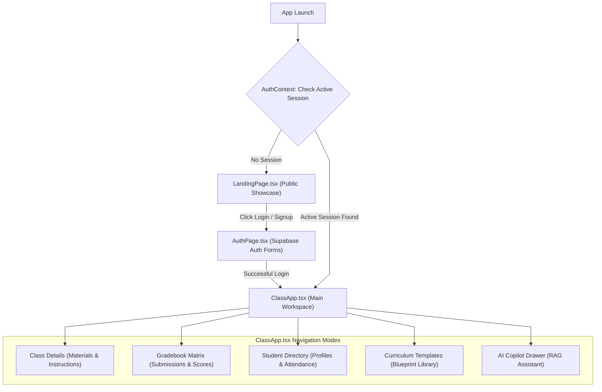
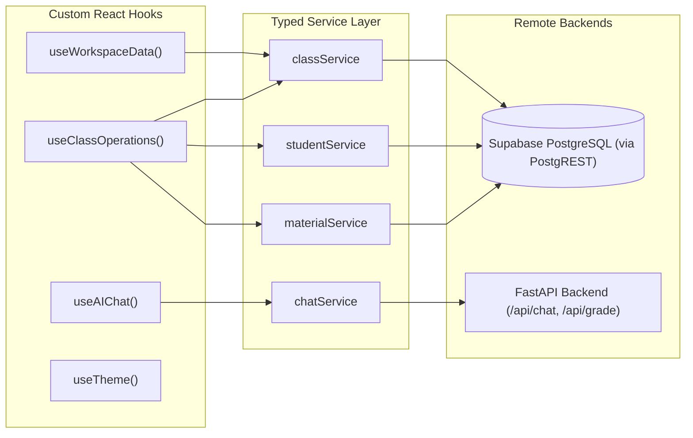

# Frontend Architecture & Component Subsystem

The **Frontend Subsystem** is a Single-Page Application (SPA) built with **React 19**, **TypeScript** (strict mode), **Vite**, and **Tailwind CSS**. It provides an intuitive workspace for educators to manage classes, construct curriculum rubrics, review student work with AI-assisted grading, and visualize learning analytics.

---

## 1. Directory Structure & Layering

```
frontend/src/
├── main.tsx                    # React root entrypoint mounting App with AuthProvider
├── App.tsx                     # Top-level view routing (LandingPage -> AuthPage -> ClassApp)
├── index.css                   # Global Tailwind directives, scrollbars, and design system variables
├── views/                      # Primary full-screen view containers
│   ├── LandingPage.tsx         # Public marketing, feature overview, and login entry
│   ├── AuthPage.tsx            # Supabase Auth login, signup, and password recovery forms
│   └── ClassApp.tsx            # Master application workspace with sidebar navigation
├── features/                   # Domain-driven feature modules
│   ├── classroom/              # Class detail tabs, materials, instructions, gradebook, rubrics
│   ├── students/               # Student roster, attendance manager, report cards, submission grading
│   ├── ai-assistant/           # Interactive RAG copilot, AI diagnostic review diffs, visualizer widgets
│   └── account/                # User profile, institute configuration, and workspace settings
├── hooks/                      # Custom React state and business logic hooks
│   ├── useWorkspaceData.ts     # Workspace-wide data fetching (institutes, classes, templates)
│   ├── useClassOperations.ts   # Active class CRUD mutations (materials, students, gradebook, attendance)
│   ├── useAIChat.ts            # Chat stream state, session history, and prompt orchestration
│   └── useTheme.ts             # Theme management (dark/light mode, custom color schemes)
├── contexts/                   # React context providers
│   └── AuthContext.tsx         # Supabase authentication session lifecycle
├── services/                   # Typed API service clients connecting to Supabase and FastAPI
│   ├── classService.ts         # Class, template, and enrollment queries
│   ├── studentService.ts       # Student directory, submissions, attendance, and scores
│   ├── materialService.ts      # Curriculum resources, blob uploads, and text extraction
│   ├── instructionService.ts   # System personas, guidelines, and rubrics
│   ├── templateService.ts      # Curriculum template instantiation
│   └── chatService.ts          # Backend /api/chat communication client
└── lib/                        # Shared utility libraries
    ├── supabase.ts             # Initialized Supabase client instance
    ├── storage.ts              # Storage bucket upload, download, and URL resolution helpers
    ├── studentCalculations.ts  # Gradebook statistics, GPA conversions, and tier logic
    └── themeStyles.ts          # Dynamic Tailwind style mapping utilities
```

---

## 2. Top-Level State Flow & View Routing

The application uses declarative state routing coordinated in `App.tsx` and `AuthContext.tsx`:



---

## 3. Core Feature Modules

### 3.1 Classroom Management (`features/classroom/`)
- **`ClassDetails.tsx`**: Central hub displaying class metadata, syllabus materials, active AI instructions, and quick action bars. Profile Edit/Save/Cancel controls (`class-profile-edit-button`, `class-profile-save-button`, `class-profile-cancel-button`) reside directly inside the **Class Profile** tab header (`class-details-tab-profile`), while CRUD buttons for **Materials** (`materials-upload-file-button`, remove `Trash2`) and **Class Guidelines** (`instructions-new-guideline-button`, delete `Trash2`) are always visible.
- **`CreateClassModal.tsx`**: Multi-step modal for creating new classes from scratch or cloning reusable templates.
- **`GradebookMatrix.tsx`**: Realtime spreadsheet-style matrix cross-referencing enrolled students against assigned materials, displaying current scores, submission badges (`Submitted`, `Evaluated`, `Graded`), and class averages.
- **`MaterialPreviewModal.tsx`**: Interactive document viewer displaying extracted content, syllabus topic tags, prerequisite gap warnings, and sample questions from the AI analysis engine.
- **`RubricBuilderModal.tsx`**: Visual rubric builder allowing teachers to construct multi-criterion rubrics with custom point weights and evaluation criteria.

---

### 3.2 Student Portfolios & Assessment (`features/students/`)
- **`StudentRegister.tsx`**: Comprehensive student directory with search, performance tier filters (`Advanced`, `Proficient`, `Developing`, `Critical Support`), and batch enrollment actions.
- **`StudentDetailModal.tsx`**: 360-degree student portfolio showing cumulative GPA, assignment history, attendance trajectory, identified concept mastery gaps, and a section-scoped `Edit / Save / Cancel` toggle (`student-detail-edit-dossier-button`, `student-detail-save-dossier-button`, `student-detail-cancel-dossier-button`) governing **Contact Dossier** and **Family & Guardians**.
- **`AttendanceManagerModal.tsx`**: Fast daily roll-call modal supporting quick status marking (`Present`, `Absent`, `Late`, `Excused`) with aggregate attendance rate recalculation.
- **`ReportCardModal.tsx`**: Printable and exportable student report card generator compiling grades, attendance records, teacher comments, and AI-assisted performance summaries.
- **`SubmissionGradingModal.tsx`**: Side-by-side grading workbench allowing teachers to review student work, view AI-suggested criterion scores, adjust points, and author student feedback.

---

### 3.3 AI Assistant & Visualizer (`features/ai-assistant/`)
- **`RAGClass.tsx`**: Interactive AI Copilot sliding drawer providing conversational pedagogical assistance, lesson planning recommendations, and automated assignment drafting.
- **`AIDiagnosticDiffModal.tsx`**: Visual diff modal presenting side-by-side comparison between existing student grades and AI-recommended rubric evaluations before publishing to the gradebook.
- **`Visualizer.tsx`**: Dynamic chart and data widget renderer supporting comparative bar charts, class mastery heatmaps, student rankings, timeline trajectories, and KPI stat counters.

---

## 4. Custom React Hooks & State Management



### Hook Responsibilities:
1. **`useWorkspaceData`**:
   - Fetches and caches the user's institutes, active classes, and curriculum templates on login.
   - Manages active institute and class selection states.
2. **`useClassOperations`**:
   - Manages granular data for the active class (students roster, linked materials, class instructions, running submissions, attendance records).
   - Exposes clean mutation handlers (`handleAddMaterial`, `handleUpdateMaterial`, `handleDeleteMaterial`, `handleAddStudent`, `handleGradeSubmission`, `handleLogAttendance`) with optimistic UI updates and error rollbacks.
3. **`useAIChat`**:
   - Manages active chat thread messages, streaming state, session history switching, and contextual prompt injection.
4. **`useTheme`**:
   - Controls application light/dark theme toggles and dynamic brand styling variables.

---

## 5. Optimistic Mutations & Blocking Progress Indicators (Plans 11 & 12)

The frontend splits data mutations into two deterministic UX patterns based on payload determinism and browser-originated stream dependencies:

### 5.1 Optimistic UI + Background Promise + Snapshot Rollback (0ms Perceived Latency)
For deterministic metadata, roster, grading, attendance, and broadcast operations:
- **Ref-Synchronized State (`classItemRef` & `classesRef`)**: Mutable React refs in `StudentRegister.tsx` and `useClassOperations.ts` track the latest state across concurrent background promises, preventing stale closure overwrites when multiple rapid actions fire simultaneously.
- **Pending Visual Badges (`isPending?: boolean`)**: Temporary entries (`temp-invite-*`, `temp-ann-*`, `temp-inst-*`, `temp-mat-*`) render immediately with subtle status pills (`"Inviting..."`, `"Publishing..."`, `"Syncing..."`, `"Adding..."`) while the Edge Function or PostgREST call resolves in the background.
- **Snapshot Rollback**: Every background promise captures a pre-mutation state snapshot (`previousState`) and restores it automatically alongside an error toast (`showToast(..., 'error')`) if the network request fails.
- **Applied Flows**:
  1. Student Enrollment & Invitation (`StudentRegister.tsx`)
  2. Daily Attendance Bulk Logger (`AttendanceManagerModal.tsx`)
  3. Class Announcements & Resend Broadcasts (`ClassDetails.tsx`)
  4. Rubric Grading & Rapid Scoring (`SubmissionGradingModal.tsx` & `StudentRegister.tsx`)
  5. Student Portal Turn-In State Reflection (`StudentApp.tsx`, Text/URL submissions in `StudentTurnInModal.tsx` & `StudentSubmissionUploadModal.tsx`)
  6. Prompting Rubrics / Instructions Add & Delete (`useClassOperations.ts`)
  7. Class Archiving, Renaming, Material Unlinking & URL Material Addition (`useClassOperations.ts`)
  8. Student Expulsion / Removal (`StudentRegister.tsx`)

### 5.2 Blocking Progress Bars & Wait Notices (`@[Quote]` Non-Optimistic Flows)
For operations where browser cancellation or premature tab closure corrupts state or aborts active byte streams:
- **Binary File Uploads** (`ClassApp.tsx` via `CustomDialogs.tsx`, `StudentTurnInModal.tsx`, `StudentSubmissionUploadModal.tsx`):
  - Displays an asymptotic progress bar (`15% → 92% → 100%`) with formatted file size (`MB`/`KB`), disables backdrop/Escape dismissal (`!isSubmitting`), and displays an explicit warning not to close or refresh the browser window while uploading to Supabase Storage.
- **Account Password Updates & Sensitive Authentication** (`AuthPage.tsx`, `StudentApp.tsx`, `AccountModals.tsx`):
  - Renders an indeterminate security progress bar (`"Encrypting credentials and refreshing session tokens — please wait..."`) and locks form inputs until Supabase Auth finishes rotating session tokens.

### 5.3 Decoupled Local State Sync vs. Database Persistence & Buffered Dossier Editing
- **Column-Filtered Class Updates (`useClassOperations.handleUpdateClass` & `classService.updateClass`)**:
  - `handleUpdateClass` checks whether `updatedFields` includes any persisted `public.classes` columns before calling `classService.updateClass`, and `classService.updateClass` short-circuits immediately when `Object.keys(dbUpdates).length === 0`. Synchronizing child collections (`students`, `materials`, `instructions`, `ragSessions`) in local React state dispatches **zero** `UPDATE public.classes` queries.
- **Buffered Student Dossier Drafts (`StudentDetailModal.tsx` & `StudentRegister.tsx`)**:
  - Contact Dossier and Family/Guardian fields (`phone`, `address`, `parentName`, `parentContact`, `parentNotes`, `statusIndicator`) are buffered in local `dossierDraft` state and persisted once via the **Save Dossier** button (`student-detail-save-dossier-button`).
  - `handleUpdateStudentDetails` forwards only `updatedFields` to `studentService.updateStudentClassData`, which short-circuits when `dbUpdates` is empty, preventing submission list updates (`{ submissions }`) from firing redundant `UPDATE public.class_students` queries.
  - Inline class renaming in `Sidebar.tsx` guards `handleSaveRename` with `renameCommittedRef` and a dirty check (`trimmed !== ws.name`) to prevent `Enter` + `onBlur` double-firing and skip unchanged class names.


