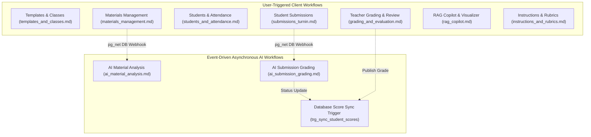

# Atomic Workflows Directory (`systems/workflows-atomic/`)

This directory provides atomic, single-responsibility operational specifications for every discrete task in the **Teach&Learn** platform.

Unlike high-level user journey flows, each **Atomic Workflow** defines a strictly isolated task from its **Trigger** to its final **Conclusion**, detailing exact preconditions, input parameters, execution steps, database/storage side effects, error boundaries, postconditions, and UI re-renders.

> [!IMPORTANT]
> **Asynchronous AI Decoupling**: In accordance with the platform architecture, event-driven AI processing (such as automated material syllabus analysis or autonomous submission evaluation) is defined as **independent, decoupled atomic workflows** triggered by database webhooks, isolated from the user-facing upload actions that preceded them.

---

## 🗺️ Atomic Workflows Taxonomy

---

## 📚 Atomic Workflows Catalog

| Category / Document | Workflow ID | Workflow Name | Trigger Type |
| :--- | :--- | :--- | :--- |
| [**`templates_and_classes.md`**](file:///home/victor/antigravity/Teacher-Assistant-Workspace/systems/workflows-atomic/templates_and_classes.md) | `ATOM-TC-01` `ATOM-TC-02` `ATOM-TC-03` `ATOM-TC-04` `ATOM-TC-05` `ATOM-TC-06` | • Create Curriculum Template • Update Curriculum Template • Delete Curriculum Template • Instantiate Class from Template • Create Blank Class • Update Class Settings & Schedule | User UI Form User UI Form User UI Action User Modal Action User Modal Action User Settings Tab |
| [**`materials_management.md`**](file:///home/victor/antigravity/Teacher-Assistant-Workspace/systems/workflows-atomic/materials_management.md) | `ATOM-MAT-01` `ATOM-MAT-02` `ATOM-MAT-03` `ATOM-MAT-04` `ATOM-MAT-05` | • Upload & Link File Material • Add Link / Plaintext Material • Resolve Material Signed URL for Preview • Unlink Material from Class • Atomic Hard Delete Material | User File Upload User Form Action User Preview Click User Unlink Action User Delete Confirmation |
| [**`ai_material_analysis.md`**](file:///home/victor/antigravity/Teacher-Assistant-Workspace/systems/workflows-atomic/ai_material_analysis.md) | `ATOM-AIM-01` | • **Event-Driven Material Syllabus & Prerequisite Gap Analysis** | **Database Webhook** (`trg_material_ai_analysis` via `pg_net`) |
| [**`students_and_attendance.md`**](file:///home/victor/antigravity/Teacher-Assistant-Workspace/systems/workflows-atomic/students_and_attendance.md) | `ATOM-STU-01` `ATOM-STU-02` `ATOM-STU-03` `ATOM-STU-04` `ATOM-STU-05` | • Direct Student Enrollment • Student Invitation Token Issuance • Daily Roll-Call Attendance Batch Logging • Aggregate Attendance Rate Recalculation • Generate Student Report Card | User Add Student Form User Invite Modal User Attendance Modal Internal State Trigger User Export Click |
| [**`submissions_turnin.md`**](file:///home/victor/antigravity/Teacher-Assistant-Workspace/systems/workflows-atomic/submissions_turnin.md) | `ATOM-SUB-01` | • **Student Assignment Submission Upload & Turn-In** | User Turn-In Action |
| [**`ai_submission_grading.md`**](file:///home/victor/antigravity/Teacher-Assistant-Workspace/systems/workflows-atomic/ai_submission_grading.md) | `ATOM-AIS-01` | • **Event-Driven Autonomous Submission Evaluation & Rubric Grading** | **Database Webhook** (`trg_submission_ai_eval` via `pg_net`) |
| [**`grading_and_evaluation.md`**](file:///home/victor/antigravity/Teacher-Assistant-Workspace/systems/workflows-atomic/grading_and_evaluation.md) | `ATOM-GRD-01` `ATOM-GRD-02` `ATOM-GRD-03` `ATOM-GRD-04` `ATOM-GRD-05` | • Fetch AI Diagnostic Breakdown • Publish Final Student Grade • Atomic Gradebook Recalculation • Batch Evaluation Synchronization • Atomic Submission Deletion | User Evaluated Chip Click User Publish Grade Button Database Trigger (`trg_sync_student_scores`) User Batch Save Button User Delete Submission Action |
| [**`rag_copilot.md`**](file:///home/victor/antigravity/Teacher-Assistant-Workspace/systems/workflows-atomic/rag_copilot.md) | `ATOM-RAG-01` `ATOM-RAG-02` `ATOM-RAG-03` `ATOM-RAG-04` | • Dispatch AI Copilot Query • Mount Dynamic Visualization Widget • Persist Chat Session History • Switch / Load Historical Session | User Chat Form Submit LLM Response Payload Parse Stream Completion Event User Session Select |
| [**`instructions_and_rubrics.md`**](file:///home/victor/antigravity/Teacher-Assistant-Workspace/systems/workflows-atomic/instructions_and_rubrics.md) | `ATOM-INS-01` `ATOM-INS-02` `ATOM-INS-03` | • Create Assistant System Persona / Policy • Build & Save Custom Rubric • Attach Rubric to Class Assignment | User Instruction Form User Rubric Builder Save User Assignment Edit |

---

## 🔬 Anatomy of an Atomic Workflow Specification

Every atomic task in this directory is systematically documented with the following sections:

1. **Workflow Identifier & Name**: Standardized tag (e.g. `ATOM-MAT-01`) and descriptive title.
2. **Trigger**: The exact event (user click, form submit, system webhook, database trigger) initiating execution.
3. **Preconditions**: Auth state, active class selection, role requirements, and database constraints.
4. **Input Parameters / Payload**: Detailed schema of arguments passed into the task.
5. **Execution Pipeline**: Step-by-step trace covering client service calls, storage operations, SQL DDL/DML, and external services.
6. **Error Handling & Rollbacks**: Failure modes, network retry policies, and transaction abort boundaries.
7. **Postconditions**: Exact database table state, storage blobs created, and cache invalidations.
8. **Conclusion & Re-render**: Terminal outcome, visible UI notification, and component state updates.
