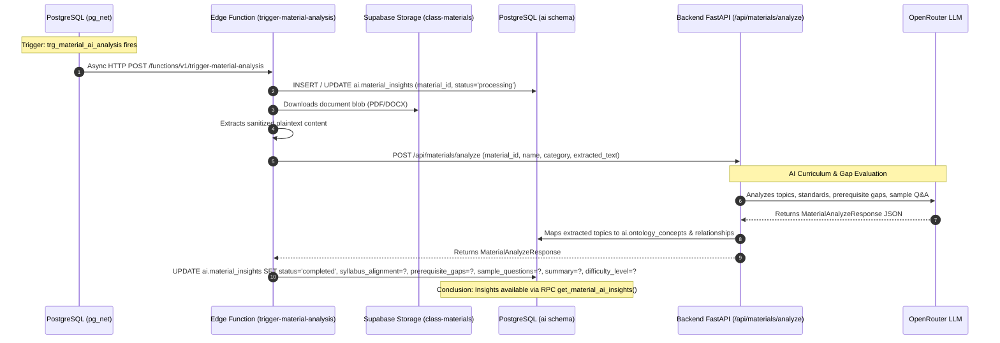

# Atomic Workflows: AI Material Analysis (Event-Driven)

This document details the discrete, asynchronous atomic task executed by the AI subsystem when a educational material is added or updated.

> [!NOTE]
> This workflow executes **completely decoupled** from the teacher's upload action. The teacher's upload workflow (`ATOM-MAT-01`) completes upon storage and DB row creation. This workflow is autonomously triggered in the background via database events.

---

## ATOM-AIM-01: Event-Driven Material Syllabus & Prerequisite Gap Analysis



---

### 1. Trigger
- **Event**: PostgreSQL trigger `trg_material_ai_analysis` executes on `AFTER INSERT OR UPDATE ON public.materials`.
- **Dispatcher**: `net.http_post` asynchronously dispatches an HTTP request to the edge function URL.

### 2. Preconditions
- The material record exists in `public.materials`.
- If file-based, the physical blob exists in `class-materials`.
- Backend API service is reachable at `BACKEND_API_URL`.
- `OPENROUTER_API_KEY` is configured.

### 3. Input Webhook Payload
```json
{
  "type": "INSERT",
  "table": "materials",
  "schema": "public",
  "record": {
    "id": "7b8f9e01-2345-6789-abcd-ef0123456789",
    "user_id": "1a2b3c4d-5e6f-7a8b-9c0d-1e2f3a4b5c6d",
    "name": "Lecture 4: Newton's Laws of Motion.pdf",
    "category": "Study Material",
    "content": [
      {
        "id": "c1d2e3f4-5a6b-7c8d-9e0f-1a2b3c4d5e6f",
        "name": "Lecture 4.pdf",
        "type": "File",
        "path": "1a2b3c4d-5e6f-7a8b-9c0d-1e2f3a4b5c6d/7b8f9e01-2345-6789-abcd-ef0123456789/c1d2e3f4-5a6b-7c8d-9e0f-1a2b3c4d5e6f"
      }
    ]
  }
}
```

---

### 4. Execution Pipeline

#### Step 1: Processing State Initialization
- Edge Function [`trigger-material-analysis`](file:///home/victor/antigravity/Teacher-Assistant-Workspace/supabase/functions/trigger-material-analysis) records the pending state in `ai.material_insights`:
  ```sql
  INSERT INTO ai.material_insights (material_id, status)
  VALUES (:material_id, 'processing')
  ON CONFLICT (material_id) DO UPDATE SET status = 'processing', updated_at = now();
  ```

#### Step 2: Binary Blob Text Extraction
- The Edge Function downloads the binary stream from `class-materials`.
- Text extraction routine strips binary formatting, extracting readable UTF-8 text (OCR or PDF stream parser).
- If the material is a `URL` or `Text`, text is extracted directly from the record's payload.

#### Step 3: Backend Analysis Request
- Edge Function sends a POST request to Backend FastAPI:
  ```http
  POST /api/materials/analyze HTTP/1.1
  Host: backend:8090
  Content-Type: application/json

  {
    "material_id": "7b8f9e01-2345-6789-abcd-ef0123456789",
    "name": "Lecture 4: Newton's Laws of Motion.pdf",
    "category": "Study Material",
    "extracted_text": "First Law: An object at rest stays at rest unless acted upon by an external force..."
  }
  ```

#### Step 4: LLM Analysis & Pedagogical Parsing
- In [`EvaluatorService.analyze_material()`](file:///home/victor/antigravity/Teacher-Assistant-Workspace/backend/src/service/evaluator.py#L164-L288):
  - Injects curriculum specialist system prompt.
  - Calls OpenRouter (e.g. `google/gemini-2.5-flash`).
  - Formats strict output JSON:
    - `summary`: Executive pedagogical overview.
    - `difficulty_level`: `"Beginner"` | `"Intermediate"` | `"Advanced"`.
    - `syllabus_alignment`: Array of `{ topic, standard_code, confidence, description }`.
    - `prerequisite_gaps`: Array of `{ prerequisite_concept, gap_detected, remedial_action }`.
    - `sample_questions`: Array of practice MCQs with options, answer, explanation, and difficulty.

#### Step 5: Knowledge Graph Integration
- Topics identified with high confidence are mapped into `ai.ontology_concepts` and linked via `ai.material_concept_mappings` with similarity weights.

#### Step 6: Persisting Final Insights
- Edge Function receives `MaterialAnalyzeResponse` and commits the final payload:
  ```sql
  UPDATE ai.material_insights
  SET status = 'completed',
      summary = :summary,
      difficulty_level = :difficulty_level,
      syllabus_alignment = :syllabus_alignment::jsonb,
      prerequisite_gaps = :prerequisite_gaps::jsonb,
      sample_questions = :sample_questions::jsonb,
      model_used = :model_used,
      updated_at = timezone('utc'::text, now())
  WHERE material_id = :material_id;
  ```

---

### 5. Error Handling & Retry Policies
- **Document Read Error**: If text extraction fails (e.g. corrupted PDF), `status` is set to `'failed'` with error details recorded in `metadata`.
- **LLM Rate Limits / Timeout**:
  - LangChain client configured with 3 retries and 60-second timeout.
  - If all retries fail, Edge Function records `status = 'failed'`, enabling manual retry through the UI.

---

### 6. Postconditions
- `ai.material_insights` has row with `status = 'completed'`.
- `ai.ontology_concepts` updated with new concept nodes if previously undiscovered.
- Client UI calling RPC `get_material_ai_insights(material_id)` immediately receives the enriched syllabus analysis.

---

### 7. Conclusion & Consumer Notification
- The analysis task completes silently in the background.
- If the teacher currently has [`MaterialPreviewModal.tsx`](file:///home/victor/antigravity/Teacher-Assistant-Workspace/frontend/src/features/classroom/MaterialPreviewModal.tsx) open, the component polls or receives Supabase Realtime notification and renders the AI Analysis tabs (Syllabus Alignment, Prerequisite Warnings, Sample Practice Questions).
