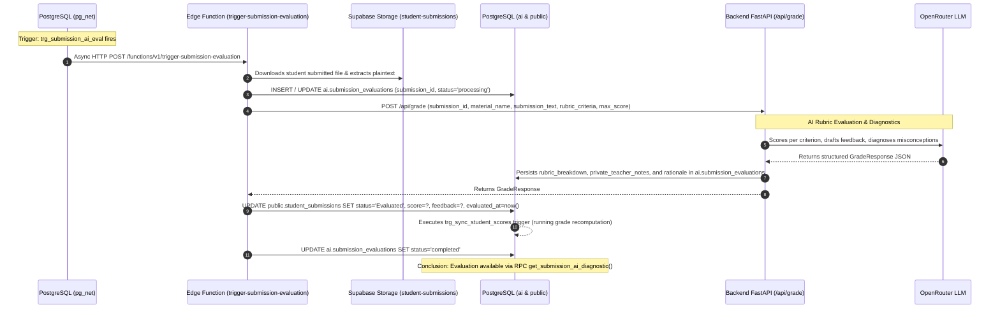

# Atomic Workflows: AI Submission Grading (Event-Driven)

This document details the discrete, asynchronous atomic task executed by the AI subsystem when a student assignment submission is turned in or updated.

> [!NOTE]
> This workflow executes **completely decoupled** from the student's turn-in action. The student's turn-in workflow (`ATOM-SUB-01`) completes upon upload and DB persistence. This workflow is autonomously triggered in the background via database events.

---

## ATOM-AIS-01: Event-Driven Autonomous Submission Evaluation & Rubric Grading



---

### 1. Trigger
- **Event**: PostgreSQL trigger `trg_submission_ai_eval` executes on `AFTER INSERT OR UPDATE OF status, content ON public.student_submissions` when `NEW.status = 'Submitted'`.
- **Dispatcher**: `net.http_post` asynchronously dispatches an HTTP request to the edge function URL.

### 2. Preconditions
- A submission record exists in `public.student_submissions` with `status = 'Submitted'`.
- The assignment material and rubric criteria exist in `public.materials`.
- Backend API service is reachable at `BACKEND_API_URL`.
- `OPENROUTER_API_KEY` is configured.

### 3. Input Webhook Payload
```json
{
  "type": "INSERT",
  "table": "student_submissions",
  "schema": "public",
  "record": {
    "id": "e4f5a6b7-8c9d-0e1f-2a3b-4c5d6e7f8a9b",
    "class_id": "2a3b4c5d-6e7f-8a9b-0c1d-2e3f4a5b6c7d",
    "student_id": "9f8e7d6c-5b4a-3f2e-1d0c-9a8b7c6d5e4f",
    "material_id": "7b8f9e01-2345-6789-abcd-ef0123456789",
    "status": "Submitted",
    "content": [
      {
        "id": "c1d2e3f4-5a6b-7c8d-9e0f-1a2b3c4d5e6f",
        "name": "Homework1.pdf",
        "type": "File",
        "path": "7b8f9e01-2345-6789-abcd-ef0123456789/c1d2e3f4-5a6b-7c8d-9e0f-1a2b3c4d5e6f"
      }
    ]
  }
}
```

---

### 4. Execution Pipeline

#### Step 1: Processing State Initialization
- Edge Function [`trigger-submission-evaluation`](file:///home/victor/antigravity/Teacher-Assistant-Workspace/supabase/functions/trigger-submission-evaluation) updates `ai.submission_evaluations`:
  ```sql
  INSERT INTO ai.submission_evaluations (submission_id, status)
  VALUES (:submission_id, 'processing')
  ON CONFLICT (submission_id) DO UPDATE SET status = 'processing', updated_at = now();
  ```

#### Step 2: Extract Text & Retrieve Assignment Rubric
- The Edge Function fetches the document from the `student-submissions` bucket and extracts the student's text.
- Queries `public.materials` to fetch the assignment title, maximum points, and assigned `rubric_criteria`.

#### Step 3: Backend Grading Service Request
- Edge Function dispatches a request to Backend FastAPI:
  ```http
  POST /api/grade HTTP/1.1
  Host: backend:8090
  Content-Type: application/json

  {
    "submission_id": "e4f5a6b7-8c9d-0e1f-2a3b-4c5d6e7f8a9b",
    "material_name": "Kinematics Problem Set 1",
    "submission_text": "Solution 1: Velocity is the time derivative of displacement...",
    "rubric_criteria": [
      { "name": "Conceptual Accuracy", "maxScore": 50, "description": "Correct physics formulas" },
      { "name": "Work Shown & Steps", "maxScore": 50, "description": "Step-by-step mathematical proofs" }
    ],
    "max_score": 100.0
  }
  ```

#### Step 4: LLM Evaluation & Diagnostics Generation
- In [`EvaluatorService.grade_submission()`](file:///home/victor/antigravity/Teacher-Assistant-Workspace/backend/src/service/evaluator.py#L40-L162):
  - Injects master pedagogical evaluator system instructions.
  - Calls OpenRouter (e.g. `google/gemini-2.5-flash`).
  - Evaluates student work against each rubric criterion.
  - Drafts compassionate, constructive student feedback.
  - Generates private teacher notes diagnosing conceptual misconceptions.
  - Normalizes scores and computes percentage and letter grade.

#### Step 5: Persisting Detailed AI Evaluation
- Stores complete evaluation payload into `ai.submission_evaluations`:
  ```sql
  UPDATE ai.submission_evaluations
  SET rubric_breakdown = :rubric_breakdown::jsonb,
      private_teacher_notes = :private_teacher_notes,
      rationale = :rationale,
      model_used = :model_used,
      status = 'completed',
      updated_at = timezone('utc'::text, now())
  WHERE submission_id = :submission_id;
  ```

#### Step 6: Updating Student Submission Record
- Updates `public.student_submissions`:
  ```sql
  UPDATE public.student_submissions
  SET status = 'Evaluated',
      score = :score,
      max_score = :max_score,
      feedback = :feedback,
      evaluated_at = timezone('utc'::text, now())
  WHERE id = :submission_id;
  ```

#### Step 7: Atomic Gradebook Recomputation
- The update to `score` in `public.student_submissions` fires PostgreSQL trigger `trg_sync_student_scores`:
  - Recomputes running weighted average for `student_id` in `class_id`.
  - Atomically updates `class_students.current_score`, `current_grade`, and `performance_tier`.

---

### 5. Error Handling & Retry Policies
- **Corrupted Document**: If text extraction returns empty or fails, `status` in `ai.submission_evaluations` is marked `'failed'`.
- **LLM Failure**: Retries 3 times via LangChain client. If unresolvable, marks `'failed'`. The teacher can trigger manual re-evaluation from the UI.

---

### 6. Postconditions
- `ai.submission_evaluations` contains full rubric breakdown and notes with `status = 'completed'`.
- `public.student_submissions` is updated to `status = 'Evaluated'`.
- Running student grade metrics in `public.class_students` are recalculated.

---

### 7. Conclusion & Consumer Notification
- The grading task completes in the background.
- In the teacher's Gradebook Matrix, the cell transitions from **"Submitted"** to an amber **"Evaluated"** badge.
- The teacher can now open the AI Diagnostic Diff Modal to review the breakdown (`ATOM-GRD-01`).
