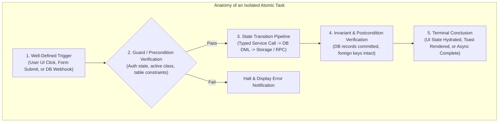
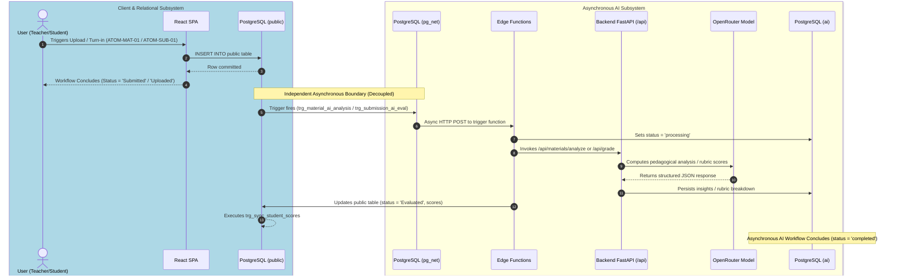

# Atomic Workflows Architecture & Execution Invariants

This document details the architectural principles, state isolation guarantees, error recovery boundaries, and execution models governing all tasks documented in `systems/workflows-atomic/`.

---

## 1. Single-Responsibility Task Isolation Architecture

Every workflow in `systems/workflows-atomic/` represents a single, non-composite task adhering strictly to the **Single Responsibility Principle (SRP)**:

### Invariant Rules:
1. **No Mixed Sync/Async Lifecycles**:
   - Synchronous user interactions (e.g., uploading a material or submitting work) terminate immediately upon local persistence.
   - Secondary compute tasks (e.g., AI document analysis or autonomous rubric grading) are **decoupled into distinct, event-driven atomic tasks** triggered by database webhooks (`pg_net`).
2. **Deterministic Trigger-to-Conclusion Bounds**:
   - Each atomic workflow has a single unambiguous entry trigger and a concrete terminal state. No task leaves database rows in indefinite dangling states.
3. **Optimistic Rendering with Transaction Safety**:
   - UI views apply optimistic mutations for latency reduction, but maintain rollback references if backend or database execution errors occur.

---

## 2. Decoupled Event-Driven AI Architecture

The separation between user actions and AI operations is enforced through asynchronous database triggers and serverless edge functions:

---

## 3. Atomic State Recovery & Error Boundaries

1. **Storage-Database Consistency**:
   - In file upload workflows (`ATOM-MAT-01`, `ATOM-SUB-01`), binary files are stored first; if subsequent database insertions fail, client-side compensation routines purge the newly created storage blob to prevent orphans.
2. **Reference-Counted Deletions**:
   - Deletions (`ATOM-MAT-05`, `ATOM-GRD-05`) use database stored procedures that count references across all `content` JSONB arrays, ensuring shared files across classes or templates are not prematurely destroyed.
3. **Idempotent Webhook Processing**:
   - Edge functions (`ATOM-AIM-01`, `ATOM-AIS-01`) check the current processing status before dispatching expensive LLM calls, avoiding duplicate invocations on re-sent webhooks.

---

## 4. Maintenance & Documentation Contract

Whenever any business logic, API route, or database trigger is added or modified in the Teach&Learn codebase:
1. Identify the corresponding atomic task identifier (`ATOM-*`) in this directory.
2. Update the input payload, execution pipeline steps, and postconditions to match the code changes.
3. If an operation introduces a new standalone task, assign a unique `ATOM-*` identifier and record its full lifecycle in the appropriate module document.
