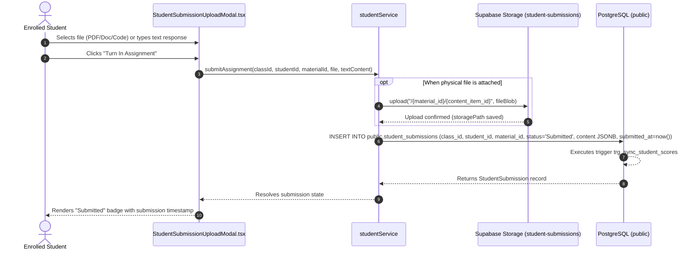

# Atomic Workflows: Student Submission Turn-In

This document details the discrete atomic task of a student submitting an assignment, uploading their work files, and creating the submission record in the database.

> [!NOTE]
> This workflow concludes when the student's work is persisted in the database and storage. The subsequent automated AI evaluation of the submission is handled as an **independent, decoupled atomic workflow** (`ATOM-AIS-01`) triggered via database webhooks.

---

## ATOM-SUB-01: Student Assignment Submission Upload & Turn-In



---

### 1. Trigger
- **Event**: An enrolled student submits an assignment through [`StudentSubmissionUploadModal.tsx`](file:///home/victor/antigravity/Teacher-Assistant-Workspace/frontend/src/features/students/StudentSubmissionUploadModal.tsx) by clicking **"Turn In Assignment"**.

### 2. Preconditions
- The student is authenticated with an active session (`auth.uid() IS NOT NULL`).
- The student is enrolled in the class (`public.class_students`).
- The assignment exists and is linked to the class via `public.class_materials`.
- The submitted file conforms to storage size (max 50MB) and MIME type allowlists.

### 3. Input Parameters
```typescript
interface SubmitAssignmentPayload {
  classId: string;
  studentId: string;
  materialId: string;
  file?: File;
  textContent?: string;
}
```

---

### 4. Execution Pipeline

#### Step 1: Storage Path Formulation & Binary Upload (if file attached)
- Client generates a unique UUID for the content item: `itemId = crypto.randomUUID()`.
- Storage path is constructed strictly per bucket security policies:
  ```
  storagePath = `${materialId}/${itemId}`
  ```
- Uploads binary blob to private bucket `student-submissions`:
  ```typescript
  const { error } = await supabase.storage
    .from('student-submissions')
    .upload(storagePath, file);
  ```
- Storage RLS policy verifies that the uploader is an authenticated enrolled student.

#### Step 2: Assemble JSONB Content Array
- Serializes document metadata:
  ```json
  [
    {
      "id": "c1d2e3f4-5a6b-7c8d-9e0f-1a2b3c4d5e6f",
      "name": "Homework1_Solution.pdf",
      "type": "File",
      "path": "7b8f9e01-2345-6789-abcd-ef0123456789/c1d2e3f4-5a6b-7c8d-9e0f-1a2b3c4d5e6f",
      "size_bytes": 1048576,
      "mime_type": "application/pdf"
    }
  ]
  ```

#### Step 3: Insert Submission Database Row
- Client inserts into `public.student_submissions`:
  ```sql
  INSERT INTO public.student_submissions (
    class_id, student_id, material_id, status, content, submitted_at
  ) VALUES (
    :classId, :studentId, :materialId, 'Submitted', :contentJSONB, timezone('utc'::text, now())
  ) RETURNING *;
  ```

#### Step 4: Running Score Trigger Execution
- PostgreSQL trigger `trg_sync_student_scores` executes on `AFTER INSERT`:
  - Recognizes that the submission has `status = 'Submitted'` (with `score = NULL`).
  - Ensures running gradebook statistics in `public.class_students` reflect the submission turn-in.

---

### 5. Error Handling & Rollbacks
- **Upload Interruption**: If the network connection drops during binary upload, the database insert is skipped, and the user receives: `"Upload failed. Please check your network and try again."`
- **Database Conflict**: If a submission already exists for this student and material, the system either updates the existing row with new content or rejects multiple turn-ins according to course settings.

---

### 6. Postconditions
- Binary blob is stored in private bucket `student-submissions`.
- Row exists in `public.student_submissions` with `status = 'Submitted'`.
- Database trigger `trg_submission_ai_eval` is queued for asynchronous evaluation (see `ATOM-AIS-01`).

---

### 7. Conclusion & UI Re-render
- The modal closes.
- The assignment card transitions from a pending state to a green **"Submitted"** chip displaying the submission timestamp.
- In the teacher's Gradebook Matrix, the corresponding cell updates to **"Submitted"**.
