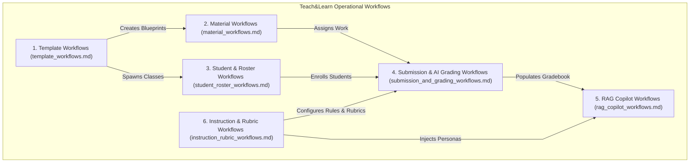

# Teach&Learn Workflows & Operations Guide

Welcome to the **Workflows Directory** for the **Teach&Learn** platform. This directory contains end-to-end, start-to-finish operational flow specifications for every primary capability and user journey in the platform.

---

## 🗺️ Workflows Overview & Navigation

Each workflow document breaks down the execution lifecycle from **UI Trigger $\rightarrow$ Service Call $\rightarrow$ Database/Storage/RPC $\rightarrow$ Backend/Edge Processing $\rightarrow$ State Updates & UI Re-render**.

---

## 📚 Workflow Catalog & Quick Reference

| Workflow Document | Workflows Documented | Key Systems Involved |
| :--- | :--- | :--- |
| [**`template_workflows.md`**](file:///home/victor/antigravity/Teacher-Assistant-Workspace/systems/workflows/template_workflows.md) | • Creating / Adding a New Curriculum Template • Creating a New Class from a Template • Updating & Archiving Templates | React UI (`ClassApp`, `CreateClassModal`), `templateService`, `classService`, `public.templates`, `public.template_materials`, `public.template_instructions`, `public.classes` |
| [**`material_workflows.md`**](file:///home/victor/antigravity/Teacher-Assistant-Workspace/systems/workflows/material_workflows.md) | • Adding / Uploading Educational Material (Files, URLs, Text) • Automated AI Syllabus & Prerequisite Gap Analysis • Material Preview & Signed URL Resolution • Unlinking vs. Atomic Hard Deletion | React UI (`ClassDetails`, `MaterialPreviewModal`), `materialService`, Supabase Storage (`class-materials`), `trigger-material-analysis`, Backend `/api/materials/analyze`, RPC `delete_material` |
| [**`student_roster_workflows.md`**](file:///home/victor/antigravity/Teacher-Assistant-Workspace/systems/workflows/student_roster_workflows.md) | • Enrolling / Adding Students to a Class • Daily Roll-Call Attendance Logging & Rate Recalculation • 360 Student Portfolio Tracking • Report Card Compilation & Export | React UI (`StudentRegister`, `AttendanceManagerModal`, `ReportCardModal`), `studentService`, `public.students`, `public.class_students`, `public.attendance_records` |
| [**`submission_and_grading_workflows.md`**](file:///home/victor/antigravity/Teacher-Assistant-Workspace/systems/workflows/submission_and_grading_workflows.md) | • Student Assignment Turn-in & Blob Upload • Autonomous AI Grading Pipeline • AI Diagnostic Diff Review & Grade Publishing • Atomic Gradebook Recalculation | React UI (`SubmissionGradingModal`, `AIDiagnosticDiffModal`, `GradebookMatrix`), `studentService`, `trigger-submission-evaluation`, Backend `/api/grade`, `trg_sync_student_scores` |
| [**`rag_copilot_workflows.md`**](file:///home/victor/antigravity/Teacher-Assistant-Workspace/systems/workflows/rag_copilot_workflows.md) | • Interactive Pedagogical Assistance Query • Contextual Prompt Serialization • Dynamic Chart & Widget Rendering • Multi-turn Session Persistence | React UI (`RAGClass`, `Visualizer`), `useAIChat`, `chatService`, Backend `/api/chat`, `ChatService`, OpenRouter LLM, `public.chat_sessions`, `langgraph` checkpointer |
| [**`instruction_rubric_workflows.md`**](file:///home/victor/antigravity/Teacher-Assistant-Workspace/systems/workflows/instruction_rubric_workflows.md) | • Creating & Applying System Personas / Policy Guidelines • Interactive Rubric Construction • Attaching Rubrics to Assignments | React UI (`ClassDetails`, `RubricBuilderModal`), `instructionService`, `public.instructions`, `public.class_instructions`, `ai.submission_evaluations` |

---

## 🎯 Architectural Principles for Workflows

1. **Deterministic Execution**:
   - Every user action flows through dedicated domain services (`frontend/src/services/`) and strongly-typed data contracts.
2. **Optimistic Updates with Safe Rollbacks**:
   - UI state updates optimistically to ensure responsive interaction, reverting if backend or database mutations fail.
3. **Event-Driven Non-Blocking AI**:
   - Long-running AI operations (document analysis, multi-criterion grading) execute asynchronously via database triggers (`pg_net`) and serverless edge functions without blocking user navigation.
4. **Data Integrity & Reference Counting**:
   - Deletions utilize atomic database stored procedures to maintain relational consistency and clean up physical storage blobs only when orphaned.
