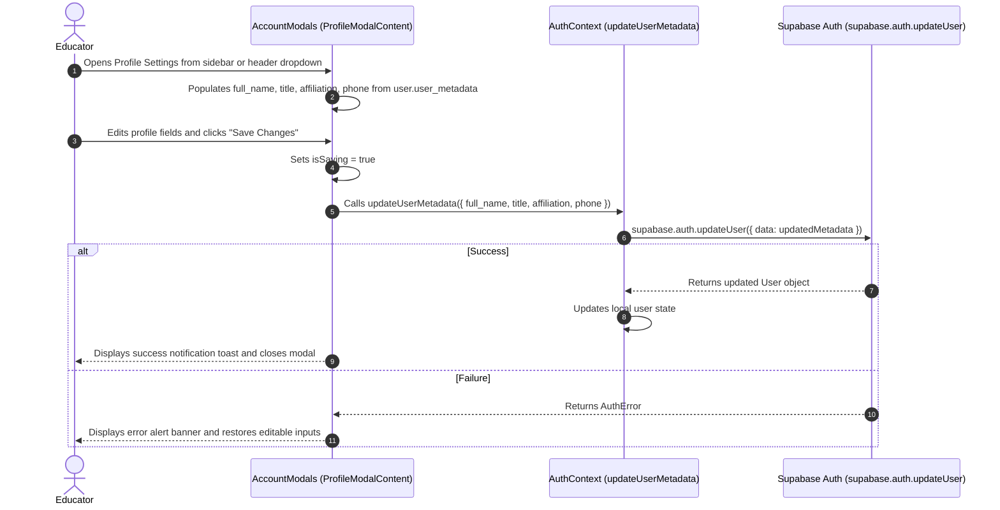
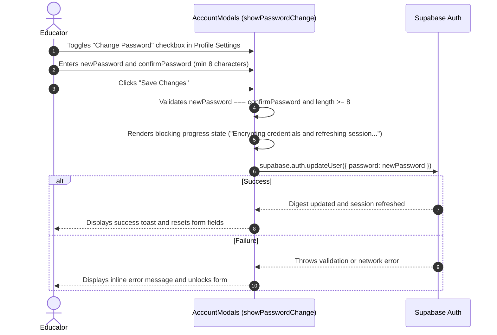
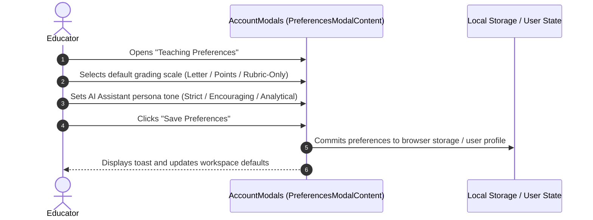

# Account & Preferences Management Workflows

This document outlines the user flows for profile configuration, teaching preferences, authentication security, and subscription tier management implemented in `frontend/src/features/account/AccountModals.tsx`.

---

## 1. Workflow: Educator Profile & Metadata Customization

Educators maintain their academic profile metadata, department affiliations, and contact records through the Profile Settings dialog.

---

## 2. Workflow: Account Password Rotation & Credential Encryption

---

## 3. Workflow: Teaching Preferences & AI Assistant Configuration

Educators configure platform-wide pedagogical behaviors, default grading approaches, and theme styling via the Preferences dialog.

