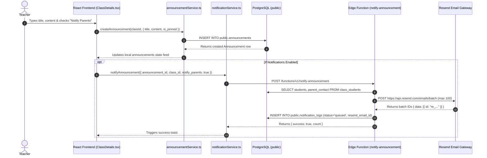

# Announcement & Notification Workflows

This document outlines the end-to-end lifecycles for class announcements, broadcast email notifications via Resend, and asynchronous delivery tracking in the Teach&Learn platform.

---

## 1. Class Announcement Creation & Multi-Recipient Notification Flow

### User Journey:
1. Teacher navigates to the **Announcements** tab in `ClassDetails.tsx`.
2. Teacher fills in the title, body content, and chooses whether to pin the announcement or broadcast email notifications to students and parents (`notify_parents`).
3. On submission, the announcement is inserted into `public.announcements`.
4. If notifications are enabled, `notificationService.notifyAnnouncement()` triggers the `notify-announcement` Edge Function.
5. The Edge Function fetches enrolled student emails and parent contacts from `public.class_students`, formats branded HTML templates, and dispatches batch emails via Resend.
6. Audit records are logged in `public.notification_logs` with status `'queued'`.
7. The UI confirms posting with a toast notification: `"Announcement posted. Notification emails queued."`.

---

## 2. Material Publishing & Update Notification Flow

### User Journey:
1. Teacher adds a new assignment or updates the due date of existing coursework in `ClassDetails.tsx`.
2. When the material is published or updated, `notificationService.notifyMaterial()` is triggered with `event_type = 'published'` or `'updated'`.
3. The `notify-material` Edge Function retrieves material details (`due_at`, `max_score`) and class roster emails.
4. An HTML email highlighting assignment due dates and submission requirements is queued through Resend.
5. Delivery audit logs are stored in `public.notification_logs` (`notification_type = 'material_published' | 'material_updated'`).

---

## 3. Student Turn-In Alert Flow

### User Journey:
1. Student submits completed assignment files via `StudentTurnInModal.tsx` in the Student Portal.
2. `studentPortalService.submitAssignment()` creates the `student_submissions` row.
3. The client calls `notificationService.notifySubmission({ submission_id, class_id })`.
4. The `notify-submission` Edge Function resolves the class instructor's email via `auth.admin.getUserById()`.
5. An alert email is dispatched to the instructor's inbox detailing the student name, material, and submission timestamp.
6. The event is recorded in `public.notification_logs` with `notification_type = 'submission_turned_in'`.

---

## 4. Webhook Status Tracking & Bounce Escalation Flow

### User Journey:
1. Mail Transport Agents (MTAs) process the email and send webhook callbacks to `/functions/v1/resend-webhook`.
2. For delivered emails (`type = 'email.delivered'`), `notification_logs` is updated to `status = 'delivered'`.
3. For hard or soft bounces (`type = 'email.bounced' | 'email.failed'`), `notification_logs` is updated to `status = 'bounced'` with the bounce error reason.
4. The Edge Function looks up the class teacher's email address and immediately dispatches an automated alert with the recipient's name, email, and bounce reason so the teacher can correct roster records.
