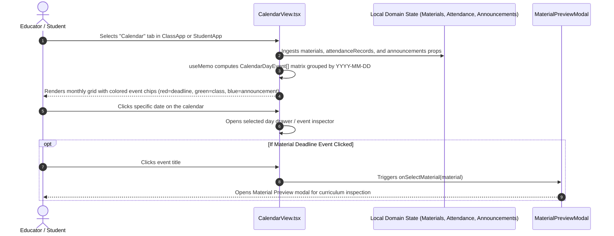
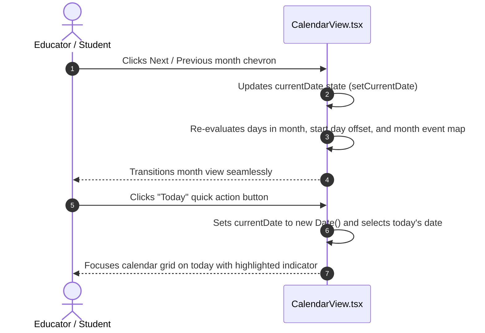

# Academic Calendar & Schedule Workflows

This document outlines the architecture and user journeys for the interactive **Academic Calendar** module (`frontend/src/features/calendar/CalendarView.tsx`), shared between educator workspaces (`ClassApp.tsx`) and the student portal (`StudentApp.tsx`).

---

## 1. Workflow: Academic Schedule Aggregation & Rendering

The Academic Calendar aggregates deadlines, classroom sessions, and course announcements into a unified monthly matrix without requiring external calendar integrations or dedicated synchronization database tables.

### Execution Invariants:
1. **Zero External Lib Dependencies**: Calendar computation uses pure JavaScript `Date` arithmetic and grid layout, keeping bundle size minimal.
2. **Real-Time Synthesis**: Events are purely derived from domain objects (`materials.due_at`, `attendance_records.date`, `announcements.created_at`).
3. **Role Adaptability**:
   - In `ClassApp.tsx`: Displays class-wide deadlines, past and scheduled attendance dates, and teacher announcements.
   - In `StudentApp.tsx`: Scoped to the student's actively selected course with clickable preview triggers.

---

## 2. Workflow: Month Navigation & Day Inspection

