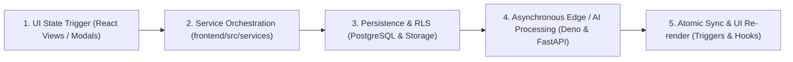
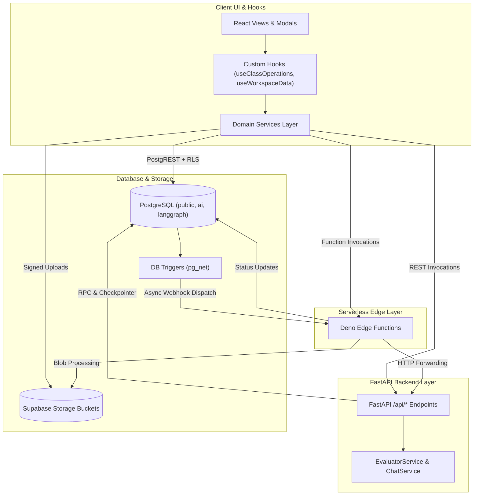

# Workflows Architecture & Execution Invariants

This document outlines the architectural patterns, state transition rules, and cross-subsystem orchestration contracts for all workflows documented in `systems/workflows/`.

---

## 1. Universal Workflow Execution Architecture

All operations across the Teach&Learn platform adhere to a deterministic 5-stage pipeline:

### Invariant Rules:
1. **Never Bypass the Service Layer**:
   - UI components must never execute direct database queries or raw fetch calls; all actions must route through typed methods in `frontend/src/services/`.
2. **Optimistic Rendering with Transaction Safety**:
   - UI state updates optimistically where appropriate, rolling back gracefully if database mutations fail.
3. **Decoupled Asynchronous Processing**:
   - Compute-heavy tasks (document text extraction, vector embedding, LLM grading) execute asynchronously via database webhooks (`pg_net`) and Edge Functions, avoiding client blocking.
4. **Single Source of Truth for Scores**:
   - Grade averages and performance tiers are never calculated manually in client memory for persistence; they are atomically computed by database trigger `trg_sync_student_scores`.

---

## 2. Cross-Subsystem Communication Matrix

---

## 3. Workflow Maintenance Contract

Whenever a workflow is modified in application code:
1. The corresponding `.md` file in `systems/workflows/` **must be updated** to reflect new parameters, status transitions, or RPC calls.
2. Sequence diagrams must accurately represent the latest invocation order and error-handling steps.
