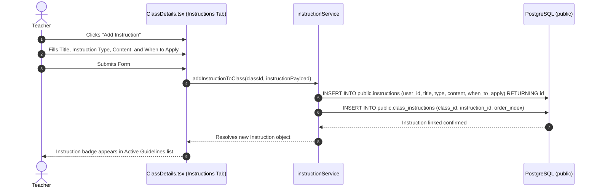
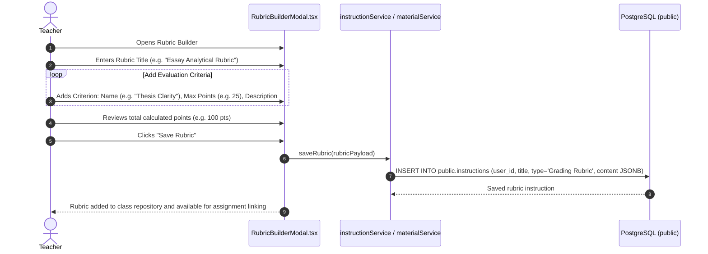
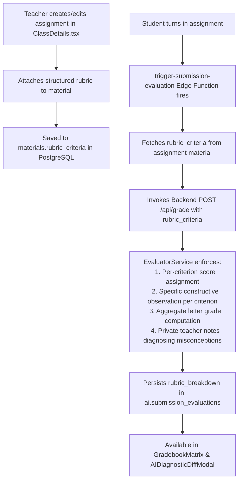

# Instruction & Rubric Authoring Workflows

This document details the start-to-finish workflows for configuring assistant personas, setting instructional guidelines, building multi-criterion evaluation rubrics, and attaching rubrics to assignments.

---

## 1. Workflow: Creating & Applying System Personas and Guidelines

Teachers can customize the AI assistant's persona, tone, pedagogical rules, and content filters for each class or across templates.

### Instruction Types:
- `System Persona`: Custom role definition (e.g. *"Socratic High School Physics Tutor"*).
- `Lesson Plan Guideline`: Formatting constraints for generating weekly schedules.
- `Material Generation Rule`: Standards for synthesizing practice questions and reading summaries.
- `Student Interaction Rule`: Tone and empathy standards when addressing student questions.
- `Assessment Creation Rule`: Rules for drafting quizzes and exams.
- `Content Filtering Rule`: Safety guidelines restricting topics or complexity.
- `General Policy`: Institutional or course grading policies.

---

## 2. Workflow: Building a Multi-Criterion Rubric

Teachers can visually design structured rubrics with custom point distributions.

### Step-by-Step Execution Details:

1. **User Initiation**:
   - The teacher opens [`RubricBuilderModal.tsx`](file:///home/victor/antigravity/Teacher-Assistant-Workspace/frontend/src/features/classroom/RubricBuilderModal.tsx).
2. **Criteria Composition**:
   - The teacher adds structured criteria rows:
     - `name`: Human-readable criterion title (e.g., *"Argumentation & Evidence"*).
     - `maxScore`: Maximum point allocation (e.g., `30.0`).
     - `description`: Detailed standard expectations.
   - The modal validates that point totals align with the desired assignment maximum score.
3. **Storage & Reuse**:
   - The rubric is stored in `public.instructions` as a `Grading Rubric` or directly embedded into `materials.rubric_criteria`.

---

## 3. Workflow: Attaching Rubrics to Assignments & Enforcing AI Assessments

When a student submits an assignment with an attached rubric, the automated AI evaluation engine strictly scores the submission against each defined criterion, ensuring objective, consistent, and explainable grading.
