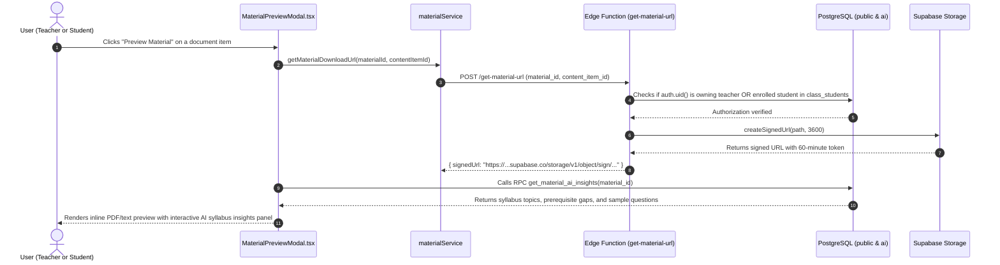
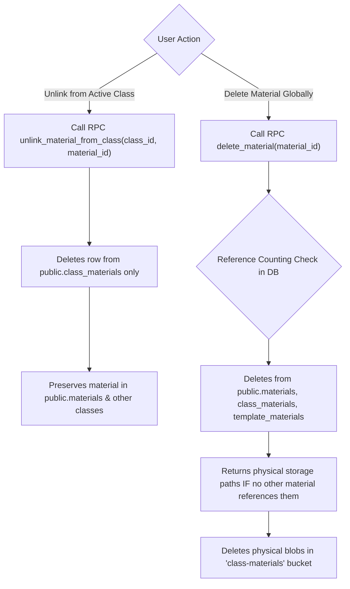

# Educational Material & Curriculum Analysis Workflows

This document details the start-to-finish workflows for adding educational materials, uploading document files, triggering automated AI syllabus gap analyses, previewing documents, and managing material lifecycles (unlinking vs. atomic deletion).

---

## 1. Workflow: Adding / Uploading Educational Material

Teachers can upload lecture slides, syllabus documents, practical assignments, reading notes, and external reference links to a class.

```mermaid
sequenceDiagram
    autonumber
    actor Teacher as Teacher
    participant UI as ClassDetails.tsx (Materials Tab)
    participant Svc as materialService
    participant Storage as Supabase Storage (class-materials)
    participant DB as PostgreSQL (public & ai)
    participant Edge as Edge Function (trigger-material-analysis)
    participant BE as Backend FastAPI (/api/materials/analyze)
    participant LLM as OpenRouter LLM

    Teacher->>UI: Selects file (PDF/Doc) or enters URL/Text & sets Category + Due Date
    Teacher->>UI: Clicks "Upload Material"
    UI->>Svc: uploadMaterial(classId, file, options)
    
    Note over Svc,Storage: 1. Upload Binary File to Storage Bucket
    Svc->>Storage: upload("/{user_id}/{material_id}/{content_item_id}", fileBlob)
    Storage-->>Svc: Upload confirmed (path saved)

    Note over Svc,DB: 2. Insert into public.materials & class_materials
    Svc->>DB: INSERT INTO public.materials (id, user_id, name, category, content JSONB, rubric_criteria)
    Svc->>DB: INSERT INTO public.class_materials (class_id, material_id, order_index)
    DB-->>Svc: Material record confirmed

    Note over DB,Edge: 3. Async DB Webhook Triggers AI Analysis
    DB->>Edge: pg_net sends webhook to trigger-material-analysis
    Edge->>Storage: Downloads document blob & extracts text
    Edge->>DB: INSERT INTO ai.material_insights (material_id, status='processing')
    Edge->>BE: POST /api/materials/analyze (extracted_text, category, name)
    BE->>LLM: Analyzes syllabus topics, prerequisite gaps, sample Q&A
    LLM-->>BE: Returns MaterialAnalyzeResponse JSON
    BE-->>Edge: Returns structured analysis
    Edge->>DB: UPDATE ai.material_insights (status='completed', syllabus_alignment, prerequisite_gaps, sample_questions)

    Svc-->>UI: Resolves Material object & appends to class state
    UI-->>Teacher: Material appears in list; AI analysis badge indicates readiness
```

### Step-by-Step Execution Details:

1. **User Form Submission**:
   - In [`ClassDetails.tsx`](file:///home/victor/antigravity/Teacher-Assistant-Workspace/frontend/src/features/classroom/ClassDetails.tsx) (Materials tab), the teacher provides:
     - **File or Link**: Native PDF, DOCX, PPTX, or external URL / plaintext.
     - **Title & Category**: `Study Material`, `Note`, `Assigned Book`, `Link`, `Practical`, `Assignment`, `Test`, `Exam`.
     - **Assignment Parameters**: Due Date, Maximum Score, Rubric Criteria (if scored).
2. **Binary Storage Upload**:
   - [`materialService.uploadMaterial()`](file:///home/victor/antigravity/Teacher-Assistant-Workspace/frontend/src/services/materialService.ts) generates a unique UUID for the material and content item.
   - Uploads the file to the `class-materials` bucket at path `/{teacher_user_id}/{material_id}/{content_item_id}`.
3. **Database Relational Linking**:
   - The material is inserted into `public.materials` with its `content` JSONB array describing the storage path, MIME type, and byte size.
   - A junction entry is inserted into `public.class_materials` linking the material to the active `class_id`.
4. **Asynchronous AI Curriculum Analysis**:
   - A database trigger dispatches an asynchronous HTTP webhook via `pg_net` to the [`trigger-material-analysis`](file:///home/victor/antigravity/Teacher-Assistant-Workspace/supabase/functions/trigger-material-analysis) Edge Function.
   - The Edge Function retrieves the document blob, extracts its plaintext content, and dispatches a request to the Backend `POST /api/materials/analyze`.
   - The Backend's `EvaluatorService` analyzes the content, detects prerequisite knowledge gaps, maps syllabus alignments, and stores findings in `ai.material_insights`.

---

## 2. Workflow: Material Preview & Signed URL Resolution

Because curriculum materials are stored in private Supabase Storage buckets, students and teachers preview files through secure, short-lived signed URLs.



### Step-by-Step Execution Details:

1. **User Interaction**:
   - The user opens [`MaterialPreviewModal.tsx`](file:///home/victor/antigravity/Teacher-Assistant-Workspace/frontend/src/features/classroom/MaterialPreviewModal.tsx).
2. **Access Control & Signed URL Generation**:
   - The client invokes the [`get-material-url`](file:///home/victor/antigravity/Teacher-Assistant-Workspace/supabase/functions/get-material-url) Edge Function.
   - The function verifies that the requester owns the class or is enrolled in a class that references this material.
   - Generates a 60-minute signed URL from Supabase Storage.
3. **Retrieving AI Insights**:
   - The modal queries the public gateway RPC `get_material_ai_insights(p_material_id)`.
   - Renders syllabus topic coverage, prerequisite gap warnings, and self-assessment practice questions alongside the document reader.

---

## 3. Workflow: Unlinking vs. Atomic Hard Deletion

The platform differentiates between **unlinking** a shared material from a single class and **deleting** the material globally.



### Unlink Material:
- **Function**: `unlink_material_from_class(p_class_id UUID, p_material_id UUID)`
- **Behavior**: Drops the `class_materials` link for that specific class. The global material record remains intact and accessible in other classes or curriculum templates.

### Delete Material (Atomic Hard Delete):
- **Function**: `delete_material(p_material_id UUID)`
- **Behavior**: 
  1. Deletes `public.materials` row (cascading to `class_materials`, `template_materials`, and `ai.material_insights`).
  2. Performs a reference count check across all other materials' `content` JSONB arrays.
  3. Returns physical file paths only if no other material references that exact storage path.
  4. The client or backend deletes the physical blobs from Supabase Storage, preventing orphan files while protecting shared files.
