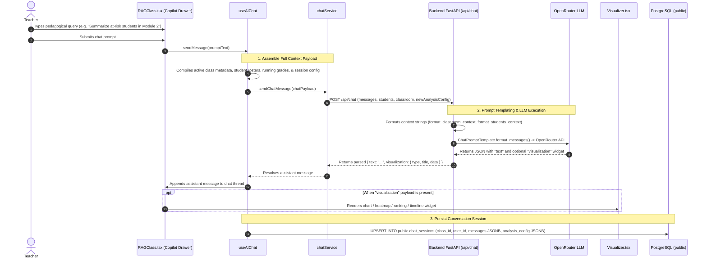

# Interactive RAG Copilot & Data Visualization Workflows

This document details the start-to-finish workflows for querying the AI Pedagogical Assistant, assembling classroom context payloads, parsing structured visualization outputs, and persisting multi-turn conversation sessions.

---

## 1. Workflow: Querying the Interactive AI Assistant

Teachers can interact with an AI Copilot specialized in class analytics, pedagogical diagnostics, student portfolio reviews, and custom lesson planning.

### Step-by-Step Execution Details:

1. **User Interaction**:
   - In [`RAGClass.tsx`](file:///home/victor/antigravity/Teacher-Assistant-Workspace/frontend/src/features/ai-assistant/RAGClass.tsx), the teacher opens the assistant sliding drawer and enters a prompt.
2. **Context Compilation**:
   - [`useAIChat`](file:///home/victor/antigravity/Teacher-Assistant-Workspace/frontend/src/hooks/useAIChat.ts) compiles:
     - **Classroom Metadata**: Subject, grade level, active instructional guidelines, teaching style.
     - **Student Rosters**: All enrolled students, performance tiers, running GPAs, submission completion rates, attendance averages.
     - **Active Directives**: Teacher preferences configured in the analysis settings.
     - **History Sequence**: Previous turns in the current conversation thread.
3. **Backend Service Processing**:
   - [`ChatService.process_chat_message()`](file:///home/victor/antigravity/Teacher-Assistant-Workspace/backend/src/service/chat.py) formats the prompt using [`formatter.py`](file:///home/victor/antigravity/Teacher-Assistant-Workspace/backend/src/lib/formatter.py) and executes the call via OpenRouter.
4. **Structured Visualization Rendering**:
   - When the LLM includes a `"visualization"` object, [`Visualizer.tsx`](file:///home/victor/antigravity/Teacher-Assistant-Workspace/frontend/src/features/ai-assistant/Visualizer.tsx) dynamically mounts the appropriate widget:
     - `charts`: Comparative bar charts and distribution graphs.
     - `heatmap`: Subject topic mastery heatmaps.
     - `ranking`: Top/bottom student performance rankings.
     - `timeline`: Longitudinal grade trajectory graphs.
     - `stats`: Key metric counters and aggregate indicators.
5. **Session History Persistence**:
   - The conversation thread is automatically saved to `public.chat_sessions` in PostgreSQL, enabling teachers to resume past analytical discussions across sessions.
