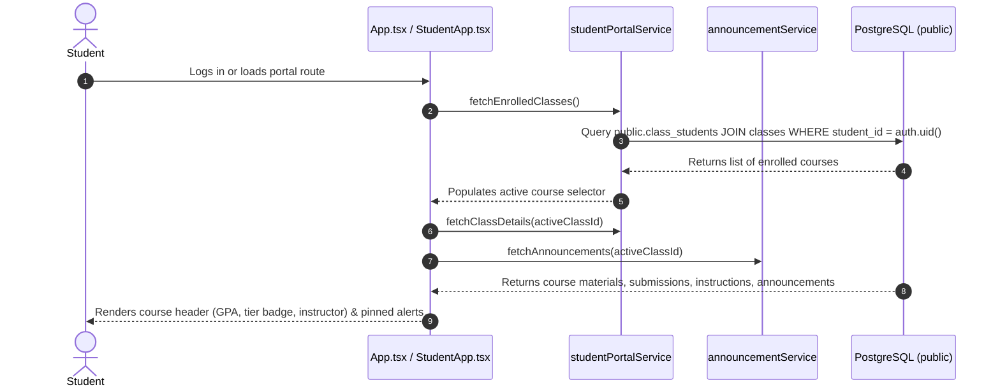
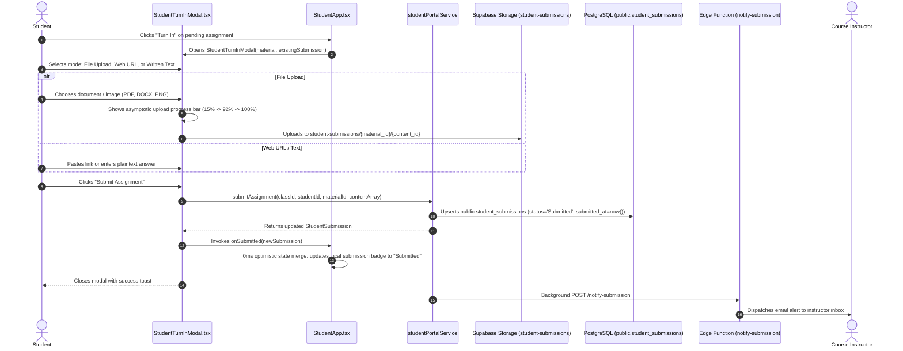
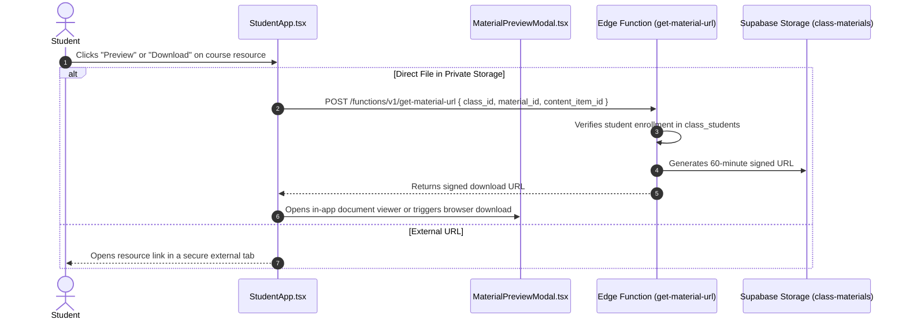
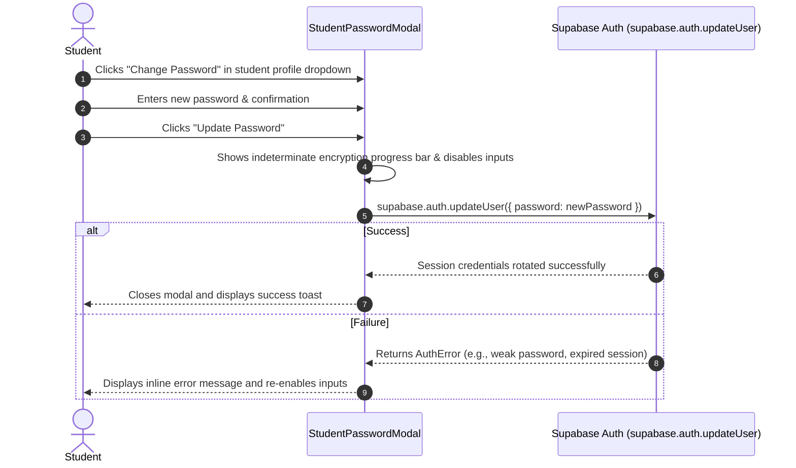
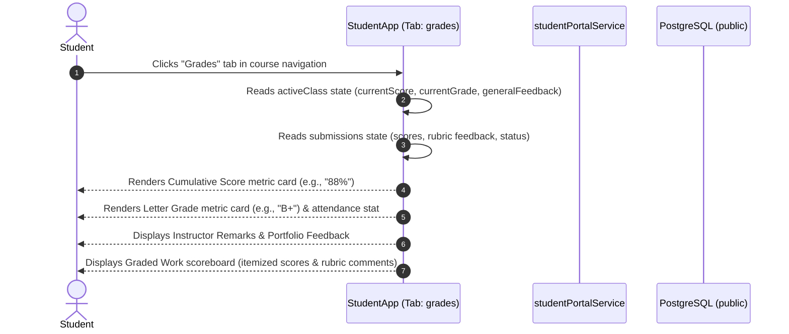

# Student Portal Workflows & Self-Service Operations

This document details the end-to-end user journeys for students accessing the platform via the dedicated **Student Portal** (`frontend/src/views/StudentApp.tsx`), including course navigation, learning resource consumption, assignment turn-in, and account security.

---

## 1. Workflow: Student Course Navigation & Dashboard Overview

When an authenticated user has `role === 'student'`, the top-level router (`App.tsx`) renders [`StudentApp.tsx`](file:///home/victor/antigravity/Teacher-Assistant-Workspace/frontend/src/views/StudentApp.tsx) instead of the educator workspace.

### Execution Details:
1. **Course Selection**: The header provides an active course dropdown. Switching courses triggers a targeted fetch for the newly selected class.
2. **Pinned Announcement Alerts**: Pinned announcements from `public.announcements` display prominently in a banner above the tab views.
3. **5 Navigation Tabs**:
   - `assignments`: Actionable assignments with due dates, max points, and submission statuses (`Assigned`, `Submitted`, `Evaluated`, `Graded`).
   - `coursework`: Reading materials, syllabus notes, and reference files.
   - `announcements`: Course-wide bulletin board notices.
   - `calendar`: Monthly schedule aggregating deadlines, class dates, and announcements.
   - `grades`: Comprehensive history of scored submissions, rubrics, and instructor feedback.

---

## 2. Workflow: Student Assignment Turn-In (Files, URLs, Text)

Students can submit their completed work directly from the `assignments` tab using [`StudentTurnInModal.tsx`](file:///home/victor/antigravity/Teacher-Assistant-Workspace/frontend/src/features/student-portal/StudentTurnInModal.tsx).

### Execution Details:
1. **Multi-Mode Submission**: Supports physical files (PDF, DOCX, PPTX, TXT, images up to 50MB), external URLs (Google Docs, GitHub, Canva), or native written text responses without synthetic URI prefixes.
2. **Instant UI Reflection (`0ms`)**: `onSubmitted(newSub)` merges the newly submitted record immediately into local React state, reflecting the `"Submitted"` badge without triggering a full multi-table reload.
3. **Blocking Progress for Binary Blobs**: When uploading physical files, `LoadingOverlay` prevents backdrop dismissal and displays an explicit warning until bytes are fully stored in the `student-submissions` bucket.

---

## 3. Workflow: Coursework Viewing & Signed Material Downloads

Students browse syllabus materials and reference documents from the `coursework` tab.

---

## 4. Workflow: Student Password & Security Setup

When students are invited to a course via email or magic link, they configure and rotate their account credentials via [`StudentPasswordModal`](file:///home/victor/antigravity/Teacher-Assistant-Workspace/frontend/src/views/StudentApp.tsx).

---

## 5. Workflow: Student Grade & Performance Review

Students inspect their academic standing, cumulative letter grade, assignment-specific scores, and qualitative instructor feedback via the `grades` sub-tab in [`StudentApp.tsx`](file:///home/victor/antigravity/Teacher-Assistant-Workspace/frontend/src/views/StudentApp.tsx).

### Invariants:
1. **RLS Isolation**: Grade statistics and submission scores are strictly scoped to the student's own `student_id` in `class_students` and `student_submissions`.
2. **Real-Time Consistency**: When new submissions are evaluated by AI or updated by instructors, active class data is refreshed via `studentPortalService.fetchClassDetails(classId)`.

