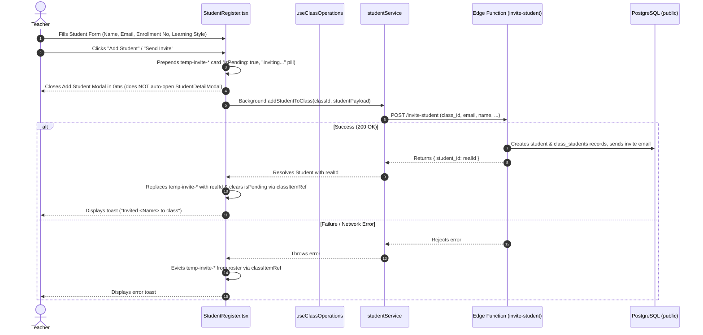
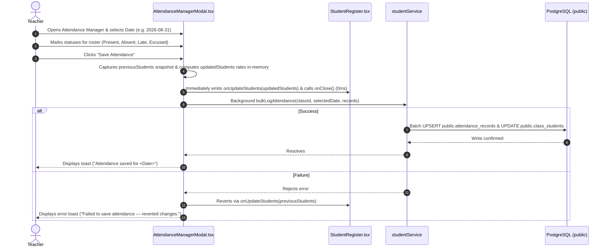
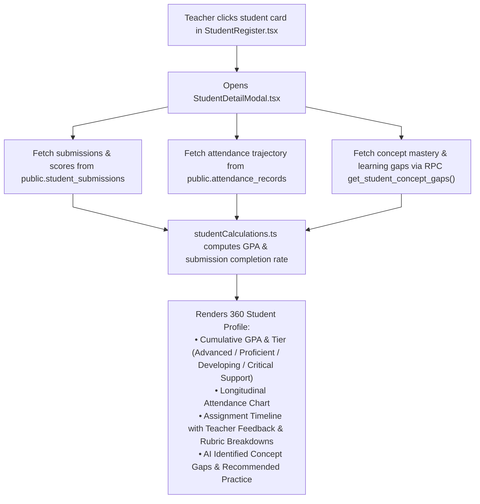
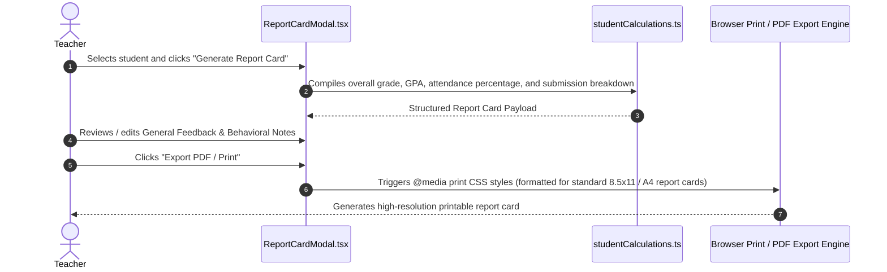

# Student Roster, Attendance & Portfolio Workflows

This document details the start-to-finish workflows for student enrollment, daily roll-call attendance tracking, 360 portfolio diagnostics, and student report card generation.

---

## 1. Workflow: Enrolling / Adding Students to a Class

Teachers can enroll students individually or generate secure invitations for student onboarding.

### Step-by-Step Execution Details:

1. **Optimistic User Initiation (`0ms`)**:
   - In [`StudentRegister.tsx`](file:///home/victor/antigravity/Teacher-Assistant-Workspace/frontend/src/features/students/StudentRegister.tsx), the teacher fills out the student form and clicks **"Add Student"**.
   - A temporary `Student` object (`id: "temp-invite-<timestamp>"`, `isPending: true`) is immediately inserted into the roster via `classItemRef`, displaying an animated `"Inviting..."` overlay pill on the card.
   - The Add Student modal closes immediately (`0ms`) without interrupting the teacher by opening `StudentDetailModal`.
2. **Background Edge Function & Database Provisioning**:
   - [`studentService.addStudentToClass()`](file:///home/victor/antigravity/Teacher-Assistant-Workspace/frontend/src/services/studentService.ts) invokes the `invite-student` Edge Function in the background.
   - The student master record is created or updated in `public.students` and linked in `public.class_students`.
3. **Reconciliation or Rollback**:
   - On success, `temp-invite-*` is swapped in-place with the real database UUID and `isPending` is cleared.
   - On error, `temp-invite-*` is evicted from `classItemRef.current.students` and an error toast is shown.

---

## 2. Workflow: Daily Roll-Call Attendance Logging & Rate Recalculation

### Step-by-Step Execution Details:

1. **Roll-Call Interface & 0ms Optimistic Application**:
   - The teacher opens [`AttendanceManagerModal.tsx`](file:///home/victor/antigravity/Teacher-Assistant-Workspace/frontend/src/features/students/AttendanceManagerModal.tsx) and marks `Present`, `Absent`, `Late`, or `Excused`.
   - Clicking **"Save Attendance"** captures a `previousStudents` snapshot, calculates the new attendance histories and percentages (`Math.round((presentCount / totalDays) * 100)`) in memory, immediately updates the parent roster (`onUpdateStudents(updatedStudents)`), and closes the modal in `0ms`.
2. **Background Database Persistence & Snapshot Rollback**:
   - [`studentService.bulkLogAttendance()`](file:///home/victor/antigravity/Teacher-Assistant-Workspace/frontend/src/services/studentService.ts) executes batch upserts into `public.attendance_records` and updates `public.class_students` in the background.
   - If the database write fails, `onUpdateStudents(previousStudents)` automatically restores the pre-save attendance state and alerts the teacher.

---

## 3. Workflow: 360 Student Portfolio Tracking

Teachers can inspect a student's holistic performance profile:

### Buffered Contact & Guardian Dossier Persistence:
- In [`StudentDetailModal.tsx`](file:///home/victor/antigravity/Teacher-Assistant-Workspace/frontend/src/features/students/StudentDetailModal.tsx), edits to Contact Dossier and Family/Guardian fields (`phone`, `address`, `parentName`, `parentContact`, `parentNotes`, `statusIndicator`) are held in local `dossierDraft` state without firing per-keystroke network requests.
- Student `email` is displayed as `readOnly` (linked to the student's Supabase Auth identity).
- Clicking **Save Dossier** (`student-detail-save-dossier-button`) dispatches a single diff payload through `handleUpdateStudentDetails` $\rightarrow$ [`studentService.updateStudentClassData()`](file:///home/victor/antigravity/Teacher-Assistant-Workspace/frontend/src/services/studentService.ts), while local roster state synchronization via `onUpdateClass({ students })` updates React state without triggering `classService.updateClass`.

---

## 4. Workflow: Generating & Exporting Report Cards

Educators can generate formal student report cards compiling grades, attendance statistics, teacher comments, and AI-assisted performance summaries.

### Report Card Contents:
- **Header**: Institute Name, Academic Year, Term, Teacher Name, Class Subject.
- **Student Details**: Student Name, Enrollment ID, Contact Info, Learning Style.
- **Academic Metrics**: Cumulative Percentage, Letter Grade, Performance Tier, Class Standing.
- **Detailed Gradebook**: List of all graded assignments, tests, and practicals with scores and maximum points.
- **Attendance Summary**: Total Days, Present Days, Unexcused Absences, Tardy Count, Attendance Rate.
- **Pedagogical Assessment**: Teacher Narrative Remarks and AI-generated conceptual strengths and areas for growth.
