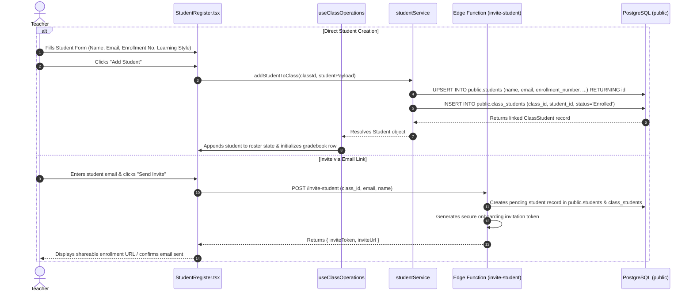
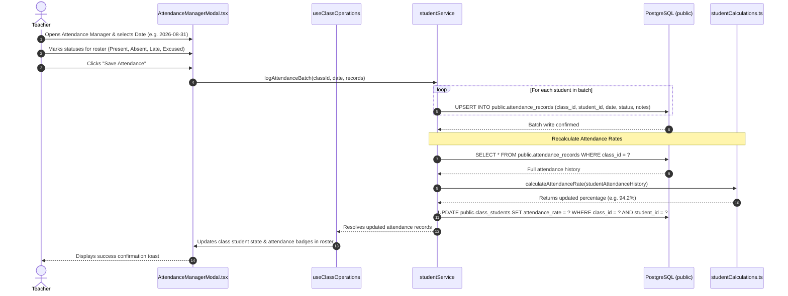
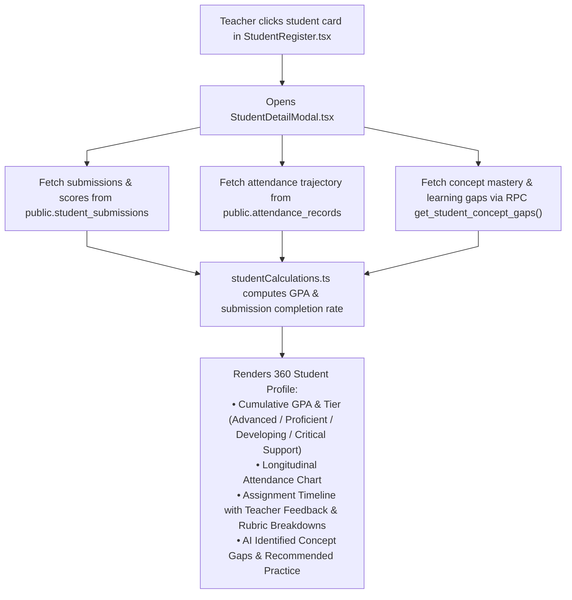
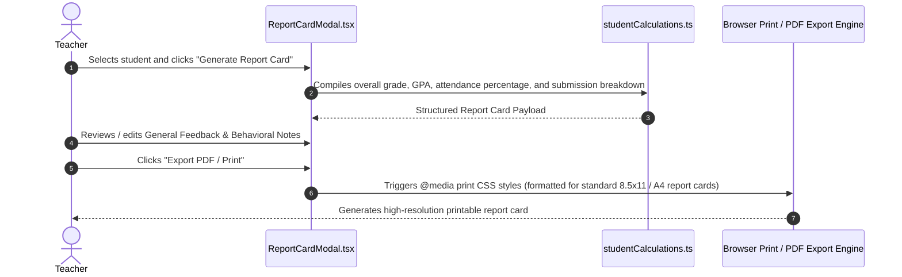

# Student Roster, Attendance & Portfolio Workflows

This document details the start-to-finish workflows for student enrollment, daily roll-call attendance tracking, 360 portfolio diagnostics, and student report card generation.

---

## 1. Workflow: Enrolling / Adding Students to a Class

Teachers can enroll students individually or generate secure invitations for student onboarding.

### Step-by-Step Execution Details:

1. **User Initiation**:
   - In [`StudentRegister.tsx`](file:///home/victor/antigravity/Teacher-Assistant-Workspace/frontend/src/features/students/StudentRegister.tsx), the teacher clicks **"Add Student"** or **"Invite Students"**.
   - Input fields: Student Full Name, Email, Enrollment/ID Number, Parent Contact Information, Learning Style (`Visual`, `Auditory`, `Kinesthetic`, `Read/Write`).
2. **Database Provisioning**:
   - The student master record is created or updated in `public.students`.
   - A junction entry is inserted into `public.class_students` initialized with default metrics (`current_score = null`, `attendance_rate = 100.0`, `status = 'Enrolled'`).
3. **Workspace State Synchronization**:
   - [`useClassOperations`](file:///home/victor/antigravity/Teacher-Assistant-Workspace/frontend/src/hooks/useClassOperations.ts) adds the student to the active class state, initializing their row in the Gradebook Matrix.

---

## 2. Workflow: Daily Roll-Call Attendance Logging & Rate Recalculation

### Step-by-Step Execution Details:

1. **Roll-Call Interface**:
   - The teacher opens [`AttendanceManagerModal.tsx`](file:///home/victor/antigravity/Teacher-Assistant-Workspace/frontend/src/features/students/AttendanceManagerModal.tsx).
   - Allows bulk actions (e.g. **"Mark All Present"**) followed by individual exceptions (`Absent`, `Late`, `Excused`).
2. **Database Persistence**:
   - [`studentService.logAttendanceBatch()`](file:///home/victor/antigravity/Teacher-Assistant-Workspace/frontend/src/services/studentService.ts) executes batch upserts into `public.attendance_records`.
3. **Attendance Rate Recalculation**:
   - [`calculateAttendanceRate()`](file:///home/victor/antigravity/Teacher-Assistant-Workspace/frontend/src/lib/studentCalculations.ts) evaluates total sessions, weighting `Present` as 100%, `Late` as 50%, and excluding `Excused` absences.
   - The recalculated `attendance_rate` is saved to `public.class_students`.
4. **Realtime UI Reflection**:
   - Attendance percentages update across the student directory, individual student cards, and AI Copilot prompt context.

---

## 3. Workflow: 360 Student Portfolio Tracking

Teachers can inspect a student's holistic performance profile:

---

## 4. Workflow: Generating & Exporting Report Cards

Educators can generate formal student report cards compiling grades, attendance statistics, teacher comments, and AI-assisted performance summaries.

### Report Card Contents:
- **Header**: Institute Name, Academic Year, Term, Teacher Name, Class Subject.
- **Student Details**: Student Name, Enrollment ID, Contact Info, Learning Style.
- **Academic Metrics**: Cumulative Percentage, Letter Grade, Performance Tier, Class Standing.
- **Detailed Gradebook**: List of all graded assignments, tests, and practicals with scores and maximum points.
- **Attendance Summary**: Total Days, Present Days, Unexcused Absences, Tardy Count, Attendance Rate.
- **Pedagogical Assessment**: Teacher Narrative Remarks and AI-generated conceptual strengths and areas for growth.
