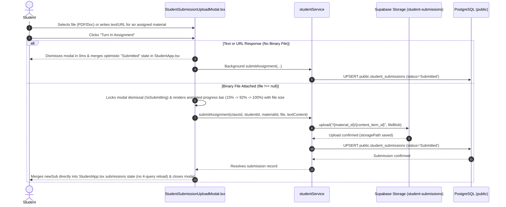
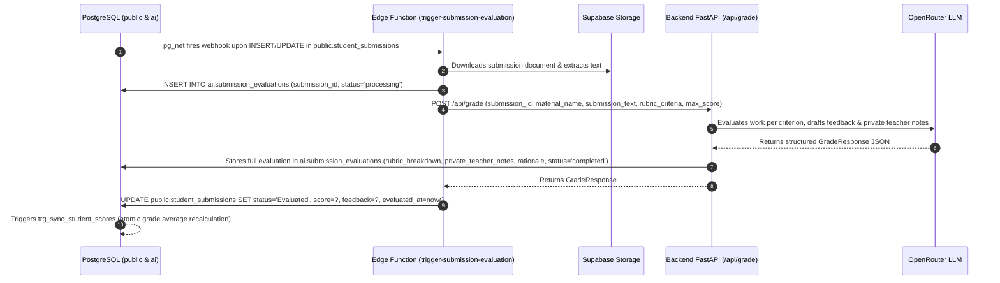
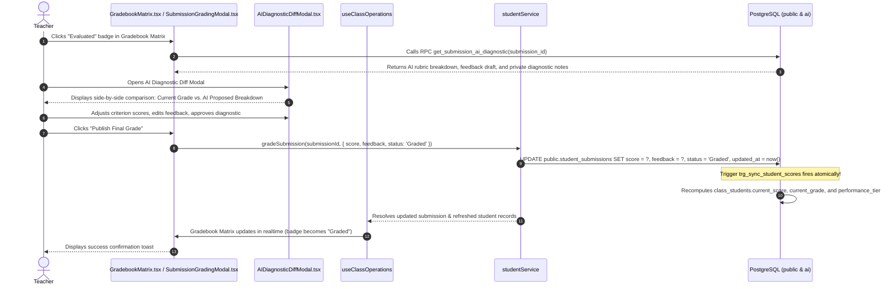

# Student Submission, AI Grading & Gradebook Workflows

This document details the start-to-finish workflows for student assignment turn-ins, automated event-driven AI grading pipelines, side-by-side diagnostic diff reviews, and atomic gradebook score synchronization.

---

## 1. Workflow: Student Assignment Turn-in & File Upload

Students turn in completed work by uploading digital documents (PDF, Word, Code, Images) or submitting written responses.

### Step-by-Step Execution Details:

1. **Hybrid User Initiation (`0ms` Optimistic vs. Blocking Progress Bar)**:
   - In [`StudentTurnInModal.tsx`](file:///home/victor/antigravity/Teacher-Assistant-Workspace/frontend/src/features/student-portal/StudentTurnInModal.tsx) or [`StudentSubmissionUploadModal.tsx`](file:///home/victor/antigravity/Teacher-Assistant-Workspace/frontend/src/features/students/StudentSubmissionUploadModal.tsx), the student or teacher submits work for an assigned material.
   - **Text / URL Submissions (`file === null`)**: The modal closes in `0ms`, immediately emits a synthetic `StudentSubmission` to update the assignment badge to `"Submitted"`, and persists the submission in the background.
   - **Binary File Uploads (`file !== null`)**: Because browser tab closure aborts active byte streams, the modal locks dismissal (`!isSubmitting`) and renders an in-modal Blocking Progress Bar Overlay (`15% → 92% → 100%`) showing the formatted file size (`MB`/`KB`) and a wait warning until the upload completes.
2. **Instant State Reflection in `StudentApp.tsx`**:
   - Instead of re-running the 4-query `loadClassData()` waterfall, `StudentApp.tsx` immediately merges `newSub` into local `submissions` state upon `onSubmitted(newSub)`.
3. **Database State Transition**:
   - The submission is recorded in `public.student_submissions` with `status = 'Submitted'`, triggering `trg_sync_student_scores`.

---

## 2. Workflow: Autonomous Event-Driven AI Grading Pipeline

Upon submission turn-in, the system automatically evaluates the work against the assignment's rubric criteria without blocking the student or teacher.

### Step-by-Step Execution Details:

1. **Webhook Event Dispatch**:
   - PostgreSQL's `trg_submission_ai_eval` fires on submission insert/update, invoking the `net.http_post` asynchronous dispatcher to [`trigger-submission-evaluation`](file:///home/victor/antigravity/Teacher-Assistant-Workspace/supabase/functions/trigger-submission-evaluation).
2. **Text Extraction & State Recording**:
   - The Edge Function retrieves the document from the `student-submissions` bucket, extracts its plaintext, and records `status = 'processing'` in `ai.submission_evaluations`.
3. **Backend Evaluator Invocation**:
   - The Edge Function invokes Backend `POST /api/grade`.
   - The Backend's [`EvaluatorService`](file:///home/victor/antigravity/Teacher-Assistant-Workspace/backend/src/service/evaluator.py) constructs a rubric-aligned prompt for OpenRouter (e.g. Gemini 2.5 Flash).
4. **Evaluation Ingestion & Score Sync**:
   - The LLM parses criterion-level scores, student feedback, and private teacher notes.
   - The submission status in `public.student_submissions` transitions to `'Evaluated'`.

---

## 3. Workflow: Teacher Grade Review, AI Diagnostic Diff & Final Publication

Teachers retain full pedagogical authority. They can inspect the AI evaluation, review differences, adjust criterion scores, and publish the final grade.

### Step-by-Step Execution Details:

1. **Gradebook Review**:
   - In [`GradebookMatrix.tsx`](file:///home/victor/antigravity/Teacher-Assistant-Workspace/frontend/src/features/classroom/GradebookMatrix.tsx), items with pending AI evaluations display an **"Evaluated"** chip.
2. **Side-by-Side Diagnostic Diff**:
   - Opening [`AIDiagnosticDiffModal.tsx`](file:///home/victor/antigravity/Teacher-Assistant-Workspace/frontend/src/features/ai-assistant/AIDiagnosticDiffModal.tsx) presents the teacher with:
     - Student's raw submission text.
     - Per-criterion point allocations generated by the AI vs. maximum possible points.
     - Editable constructive feedback for the student.
     - Private diagnostic notes (misconceptions identified, remedial recommendations).
3. **Teacher Adjustments & Publishing**:
   - The teacher can override any score or edit the commentary.
   - Clicking **"Publish Grade"** transitions `status` to `'Graded'`.
4. **Atomic Grade Recalculation**:
   - The PostgreSQL trigger `trg_sync_student_scores` recalculates:
     - `current_score`: Running weighted percentage across all graded assignments.
     - `current_grade`: Standard letter grade (`A`, `B`, `C`, `D`).
     - `performance_tier`: Tier category (`Advanced`, `Proficient`, `Developing`, `Critical Support`).
   - All student cards, gradebook cells, and report card metrics update automatically.
