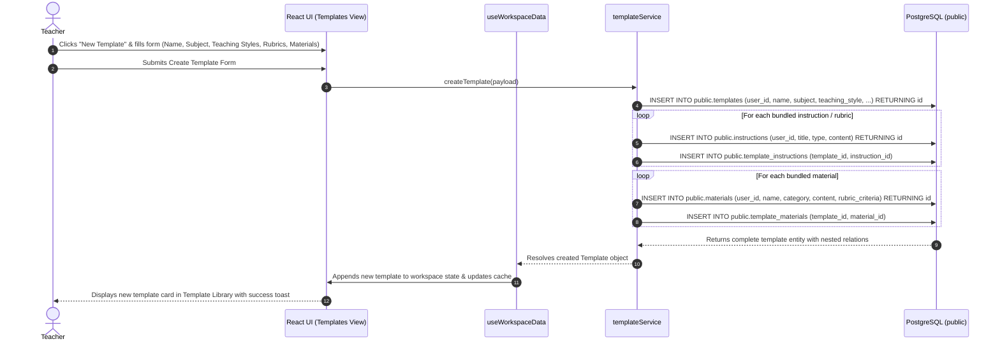
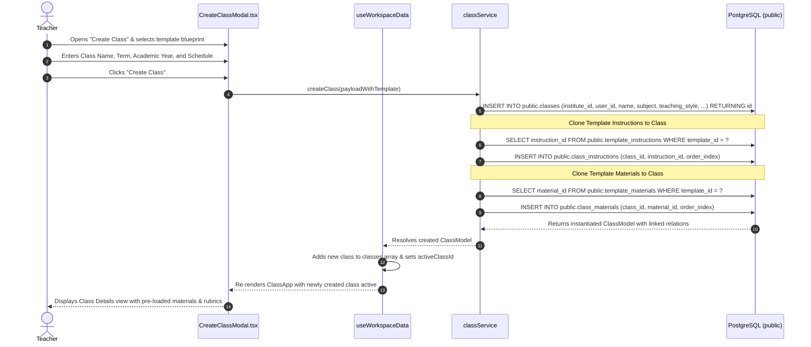

# Curriculum Template Workflows

This document outlines the start-to-finish workflows for creating, managing, and instantiating **Curriculum Templates** in the Teach&Learn platform.

---

## 1. Workflow: Adding / Creating a New Template

Curriculum templates serve as reusable pedagogical blueprints containing default subject settings, teaching methodologies, assessment preferences, pre-packaged study materials, and instructional guidelines/rubrics.

### Step-by-Step Execution Details:

1. **User Initiation**:
   - The educator navigates to the **Templates** tab in [`ClassApp.tsx`](file:///home/victor/antigravity/Teacher-Assistant-Workspace/frontend/src/views/ClassApp.tsx) and clicks **"Create New Template"**.
   - The educator defines:
     - **Metadata**: Template Name, Subject, Grade/Proficiency Level, Academic Description.
     - **Pedagogical Settings**: `teaching_style` (e.g. `Socratic Method`, `Hands-On`), `assessment_preference` (e.g. `Essays`, `Project-Based`).
     - **Instructions Preset**: System personas, lesson plan guidelines, or grading rubrics.
     - **Materials Preset**: Standard syllabus documents, assigned reading lists, or assignment starters.
2. **Frontend Service Invocation**:
   - [`templateService.createTemplate()`](file:///home/victor/antigravity/Teacher-Assistant-Workspace/frontend/src/services/templateService.ts) is called with the compiled payload.
   - The user session is authenticated via `supabase.auth.getUser()`.
3. **Database Persistence**:
   - The parent record is inserted into `public.templates`.
   - Any bundled instructions are inserted into `public.instructions` and linked via `public.template_instructions`.
   - Any pre-packaged materials are inserted into `public.materials` and linked via `public.template_materials`.
4. **State Update & UI Re-render**:
   - The hook [`useWorkspaceData`](file:///home/victor/antigravity/Teacher-Assistant-Workspace/frontend/src/hooks/useWorkspaceData.ts) updates its local `templates` state array.
   - The template library UI updates immediately without requiring a full page refresh.

---

## 2. Workflow: Creating a New Class from a Template

Educators can instantiate an active, semester-ready classroom by selecting a pre-existing template blueprint.

### Step-by-Step Execution Details:

1. **User Initiation & Blueprint Selection**:
   - In [`CreateClassModal.tsx`](file:///home/victor/antigravity/Teacher-Assistant-Workspace/frontend/src/features/classroom/CreateClassModal.tsx), the user selects an Institute and chooses **"Start from Template"**.
   - The modal previews the template's teaching styles, attached materials, and rubrics.
   - The user enters class-specific attributes: Course Section, Academic Year, Term/Semester, Weekly Schedule.
2. **Service Orchestration**:
   - The modal calls [`classService.createClass()`](file:///home/victor/antigravity/Teacher-Assistant-Workspace/frontend/src/services/classService.ts).
3. **Database Junction Population**:
   - A new row is inserted into `public.classes` with `user_id = auth.uid()`.
   - The service fetches all `instruction_id` records attached to the source template and creates corresponding rows in `public.class_instructions` with indexed `order_index`.
   - The service fetches all `material_id` records attached to the source template and creates corresponding rows in `public.class_materials` with indexed `order_index`.
4. **Context Switching & Workspace Hydration**:
   - [`useWorkspaceData`](file:///home/victor/antigravity/Teacher-Assistant-Workspace/frontend/src/hooks/useWorkspaceData.ts) appends the new class and automatically switches `activeClassId` to the newly instantiated class.
   - The UI transitions directly into the **Class Details** view, fully populated with the template's materials and instructions.

---

## 3. Workflow: Updating & Archiving Templates

1. **Updating a Template**:
   - The teacher modifies name, description, teaching style, or assessment preferences in the UI.
   - [`templateService.updateTemplate(id, payload)`](file:///home/victor/antigravity/Teacher-Assistant-Workspace/frontend/src/services/templateService.ts) executes an `UPDATE` on `public.templates WHERE id = ? AND user_id = auth.uid()`.
   - Future classes instantiated from this template receive the updated defaults (existing classes created from the template remain unaffected, preserving historical integrity).
2. **Deleting / Archiving a Template**:
   - When a teacher deletes a template, [`templateService.deleteTemplate(id)`](file:///home/victor/antigravity/Teacher-Assistant-Workspace/frontend/src/services/templateService.ts) deletes the row from `public.templates`.
   - Cascade rules cleanly drop junction entries in `public.template_materials` and `public.template_instructions` without deleting the underlying global materials or instructions.
